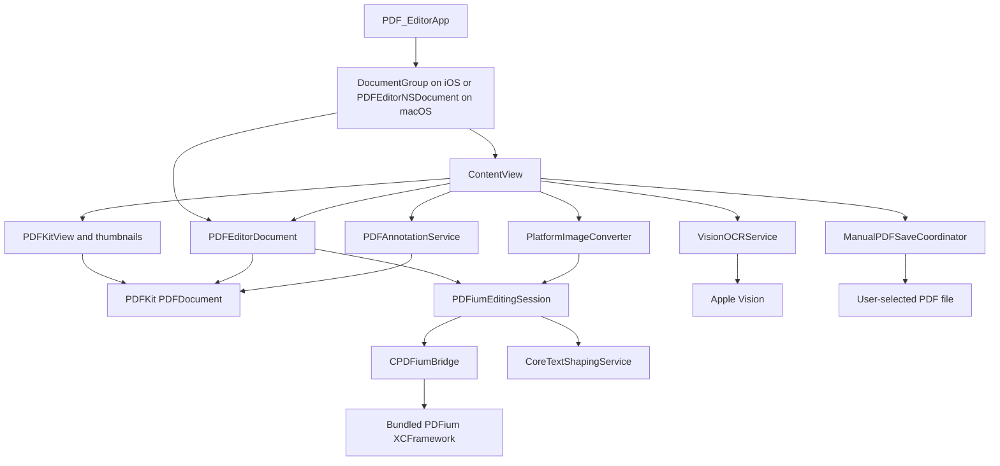

# PDF Editor Technical Documentation

## 1. System overview

PDF Editor uses SwiftUI `DocumentGroup` on iOS and iPadOS and an app-owned AppKit `NSDocument` host on macOS. `PDFEditorDocument` remains the cross-platform mutation owner; `PDFEditorNSDocument` owns the macOS file lifecycle and explicitly opts out of autosave-in-place and permanent Versions history. The normal path uses:

- PDFKit for document presentation, selection, thumbnails, annotations, and a secondary in-memory view of the current bytes.
- A local `PDFiumBridge` Swift package for the primary editing session and page-object mutations.
- CoreText for complex or missing-glyph replacement text overlays.
- Vision for on-device text recognition.
- ImageIO for bounded, orientation-aware image decoding and PNG/JPEG page-export encoding.

The app has no reviewed first-party networking, account, cloud-sync, analytics, or backend path. That is a source observation, not runtime proof that the bundled native library never performs I/O.

### Runtime status

| Path | Status | Notes |
| --- | --- | --- |
| `PDF_EditorApp` → platform document host → `PDFEditorDocument` → `ContentView` | Implemented | `DocumentGroup` on iOS/iPadOS; `PDFEditorNSDocument` on macOS. |
| `PDFEditorDocument` → `PDFiumEditingEngine` | Implemented | Primary editing path for new and unlocked documents. |
| PDFKit display and annotation mutation | Implemented | Page/object operations refresh the visible document from serialized editing-session bytes. Successful annotation mutations preserve the current PDFKit document identity while synchronizing and verifying the PDFium session. Byte-snapshot rollback and Undo/Redo synchronize replacement pages into the existing unlocked presentation document rather than replacing it. |
| Explicit save | Implemented | macOS and iOS expose Save and Save As toolbar actions. On macOS, `PDFEditorNSDocument` presents the native panel, prepares and verifies the candidate, then performs the AppKit save operation. Identity changes only after success. It declares `autosavesInPlace`, `autosavesDrafts`, and `preservesVersions` false: unsaved changes still receive native close protection, but Browse All Versions and volume-version-storage warnings are disabled. iOS uses the SwiftUI file exporter. |
| Vision OCR | Implemented, optional | Invoked only from the OCR menu. Recognition results require user review before text-layer insertion. |
| `PDFKitEditingEngine` as a complete backend | Experimental / inactive | Not selected as the document's normal engine. It is used internally for metadata mutation. |
| Full page-order UI | Implemented | The toggleable Pages panel exposes selection, per-thumbnail extraction, full-list drag reordering, 90-degree rotation, and deletion except for the final page. |
| PDF page image export | Implemented | The Tools panel exports the current page or all pages as separate PNG/JPEG files at 72, 144, or 300 DPI with progress and cancellation. |
| Document metadata UI | Inactive | Metadata commands exist in the engine surface, but `ContentView` does not expose them directly. |
| Remote or hosted service mode | Not implemented | No configuration or adapter exists in the reviewed source. |

## 2. Architecture

The app separates platform-neutral editing commands from concrete PDF engines. The document object coordinates PDFium, PDFKit, persisted/working bytes, and undo; `ContentView` and `ManualPDFSaveCoordinator` own explicit save initiation and file replacement.



### Layers and dependency direction

1. **Application composition**: `PDF_EditorApp.swift` creates a `DocumentGroup` on iOS/iPadOS. On macOS, `PDFEditorDocumentController` is installed before launch completion, suppresses AppKit document-window restoration, records explicit PDF-open requests, and instantiates `PDFEditorNSDocument`, which hosts `ContentView` and its `PDFEditorDocument` model.
2. **Presentation**: `ContentView.swift` and `FeatureViews.swift` own transient UI state, the visible-by-default Tools sidebar, toggleable Pages panel, viewing rail, Comment List, explicit Save and Save As actions, and document operations. On macOS, Open invokes `NSDocumentController`; File → Open Recent and the Tools sidebar share its recent-document list, while `PDFEditorNSDocument` owns the native title, represented URL, nonrestorable window controller, tabbing, Save/Save As operation, and close protection. `PDFEditorApplicationDelegate` schedules one native Open panel after the app first becomes active, covering ordinary launch and Xcode Run without relying on AppKit's default-launch flag or restoration timing; the deferred final check suppresses that panel when an explicit PDF open or existing document has arrived. A Dock/Finder reopen presents the panel only when no document or existing Open panel is visible, otherwise it restores existing document windows. A successful Save As lets AppKit update document identity; failure leaves the original identity and unsaved state intact. The startup window attachment still performs the one-time filled-window layout after the native Open panel closes. `PDFKitView.swift` bridges SwiftUI to `PDFView` on AppKit and UIKit.
3. **Document coordination**: `PDFEditorDocument.swift` owns source bytes, the last explicitly persisted bytes, the PDFium session, the PDFKit display document, password authorization, save policy, signature consent, and Undo registration.
4. **Core abstraction**: `PDFEditingEngine.swift` defines platform-neutral metadata, page commands, results, errors, and the engine/session protocols.
5. **Concrete engines**: `PDFiumEditingEngine.swift` is primary. `PDFKitEditingEngine.swift` is a limited alternate implementation and a metadata helper.
6. **Services**: Coordinated manual file replacement, OCR, CoreText shaping, image conversion, and annotation logic are isolated services but are constructed directly rather than injected.
7. **Native bridge**: the `CPDFiumBridge` C target adapts Swift-compatible functions to the bundled PDFium C API and locally patched object-editing functions.

### Composition and lifecycle ownership

- SwiftUI owns the iOS/iPadOS `ReferenceFileDocument` lifecycle. On macOS, `PDFEditorNSDocument` mirrors `EditorState` and pending inline edits into AppKit's change count, so native close protection reflects the actual working state while permanent Versions remain disabled.
- `PDFEditorDocument` owns an optional, lazily created `any PDFEditingSession` and the corresponding PDFKit `PDFDocument` used by the UI. Initial display does not wait for creation of the mutation session.
- `PDFiumEditingSession` owns one opaque C document handle. It closes the handle on deinitialization.
- `PDFiumRuntime.shared` initializes the PDFium library once and destroys it when the process-level singleton is deinitialized.
- `ContentView` owns OCR tasks and their original page/revision contexts. A new document-wide OCR run cancels the previous one, and view disappearance cancels the active batch task.
- `PDFKitView.Coordinator` owns notification observers, gesture recognizers, selection overlays, and the current gesture interaction state.
- `ContentView` owns a cancellable page-object load task, a revision-scoped per-page cache, and an observable pending-text store. The current page is inspected on an independent background PDFium session and the next page is prefetched. Display inspection uses one native page load to batch-copy recursive object paths and lightweight object information instead of reopening and reparsing the page for every object.
- `PDFiumAccess.lock`, defined in the engine layer, is the single process-wide recursive lock shared by document transactions and all 23 session entry points. It protects creation, destruction, metadata/signature queries, inspection, mutation, export, and error-code probes across foreground and background handles. Runtime singleton lookup occurs under that same lock before initialization, avoiding an inverted lock/once-initialization order. Private session helpers execute inside protected entry points; no lock is held across an `await`.

There is protocol-based engine separation, but no application-level dependency-injection container. `PDFEditorDocument` constructs `PDFiumEditingEngine` directly, and `ContentView` constructs its services directly.

## 3. Project structure

### Application source

| Path | Responsibility |
| --- | --- |
| `PDF Editor/PDF_EditorApp.swift` | Application entry point and document scene. |
| `PDF Editor/ContentView.swift` | Main editor UI, visible-by-default/toggleable Tools sidebar and toggleable Pages panel, macOS recent-document state, narrow right-side viewing rail composition, Highlight and signature-placement state, Comment List integration, separate Save/Save As/Tools/OCR toolbar items, imports/exports, OCR workflow, protected merge and Protect PDF flows, and transient view state. |
| `PDF Editor/FeatureViews.swift` | Pages panel and narrow viewing rail with display, zoom, direct page-number, total-page, and separate previous/next controls; Full Screen is exposed only on macOS, where it is implemented; English tool panels whose E-sign category exposes Fill in form fields, Add a signature, Add a checkmark, and Add a crossmark without Request e-signatures; the macOS Tools sidebar's bottom Recent files section with up to five cached Quick Look thumbnails; Protect PDF and Remove Password actions plus the protection password/confirmation form; reusable signature library, preview, deletion, and drawing pad; compact cross-platform PDF-image export options; multi-line Add Comment and Comment Editor views; Comment List; protected-merge password sheet; OCR result views; object inspector; and annotation inspector. |
| `PDF Editor/Core/PDFEditingEngine.swift` | Engine/session protocols, page command model, metadata model, export policy, and shared errors. |
| `PDF Editor/Core/PDFiumEditingEngine.swift` | Primary page and page-object engine, native handle management, batch display-object decoding, verification, rollback, permissions, text fallback, images, and annotation-color bridge. |
| `PDF Editor/Core/PDFKitEditingEngine.swift` | Page-level PDFKit implementation and metadata mutation helper. |
| `PDF Editor/Core/PDFAnnotationModel.swift` | Annotation references, kinds, colors, snapshots, and partial updates. |
| `PDF Editor/Core/PDFAcroFormModel.swift` | Stable AcroForm Widget references, field/control kinds, values, options, and verification snapshots. |
| `PDF Editor/Core/PDFFormDesignModel.swift` | Authored-field drafts, isolated design session, and rotation/crop-aware page-to-preview transforms. |
| `PDF Editor/Services/PDFFormDesignService.swift` | Designer-owned Widget discovery, field/group validation, creation, replacement, and round-trip/canonical-field-tree checks. |
| `PDF Editor/Platform/PDFFormDesignerView.swift` | Separate responsive design sheet with page selection, labeled field overlays, placement, drag/resize, inspector, and draft Undo/Redo. |
| `PDF Editor/Platform/PDFFormPlacementView.swift` | Temporary one-shot native placement surface for sidebar tools: page click/drag, outline, coordinate conversion, Escape, and touch navigation. Removed after placement or cancellation to restore native Widget input. |
| `PDF Editor/Core/PDFBookmarkModel.swift` | Index-path bookmark identity, nested snapshots, titles, and optional page destinations. |
| `PDF Editor/Core/SignatureLibraryModel.swift` | Codable saved-signature templates, normalized point data, validation errors, and storage limits. |
| `PDF Editor/Document/PDFEditorDocument.swift` | Persisted/working byte separation, active engine, PDFKit refresh, unsaved-state tracking, mutation transaction boundary, Undo/Redo, security options, OCR insertion, and annotation round-trip verification. |
| `PDF Editor/Document/PDFExportDocument.swift` | `FileDocument` wrapper for exported PDF bytes and preferred filenames. |
| `PDF Editor/Document/ImageExportDocument.swift` | `FileDocument` wrapper for per-page PNG/JPEG bytes, content type, and preferred filename. |
| `PDF Editor/Platform/PDFKitView.swift` | AppKit/UIKit `PDFView` bridge, selection synchronization, direct object/annotation manipulation overlays, freehand gesture preview/commit, macOS Shift-anchored straight-line Ink preview/commit, selected-Highlight/Ink action bars and popovers, zoom-aware Ink hit testing, macOS note-icon hover tracking, and annotation-anchored Comment Editor popover presentation. |
| `PDF Editor/Services/SignatureLibraryStore.swift` | Main-actor local signature-template loading, validation, atomic Application Support persistence, and deletion. |
| `PDF Editor/Platform/PageThumbnailView.swift` | PDFKit thumbnail rendering for the page sidebar. |
| `PDF Editor/Services/CoreTextShapingService.swift` | Font coverage analysis, complex-script detection, and CoreText PDF overlay creation. |
| `PDF Editor/Services/ManualPDFSaveCoordinator.swift` | Security-scoped, `NSFileCoordinator`-protected replacement writes; focused macOS File commands; and the shared AppKit recent-document model used by File → Open Recent and the Tools sidebar. |
| `PDF Editor/Services/PDFManualSavePreparationService.swift` | Builds Save candidates on an independent background session, applies pending text rewrites and requested password protection, and verifies protected output before publication. |
| `PDF Editor/Services/PDFAnnotationService.swift` | Annotation creation, resolution, mutation, geometry transformation, snapshotting, and verification. |
| `PDF Editor/Services/PDFAcroFormService.swift` | Existing Widget discovery, persistent-value comparison, and PDFKit reopen verification for AcroForm fields. |
| `PDF Editor/Services/PDFBookmarkService.swift` | Outline snapshots, add/rename/delete operations, stage-specific failures, and outline-only presentation synchronization with destinations rebound to existing pages. |
| `PDF Editor/Services/PDFIncrementalBookmarkWriter.swift` | Classic-xref incremental outline/catalog writer; appends bookmark revisions without replacing the input byte prefix. |
| `PDF Editor/Services/PDFPageResourceIntegrityService.swift` | Reads page ColorSpace, Pattern, and Shading resource counts and rejects candidates that lose those resources. |
| `PDF Editor/Services/PlatformImageConverter.swift` | ImageIO decode, size limiting, orientation handling, BGRA conversion, and alpha unpremultiplication. |
| `PDF Editor/Services/PDFPageImageExporter.swift` | Sequential crop-box page rendering, rotation-aware DPI sizing, PNG/JPEG encoding, cancellation, progress, and per-page resource limits. |
| `PDF Editor/Services/VisionOCRService.swift` | Selectable-text policy, rendering, Vision recognition, batch processing, and rotation-aware coordinate conversion. |

### Local package and validation

| Path | Responsibility |
| --- | --- |
| `Packages/PDFiumBridge/Package.swift` | Local Swift package manifest, binary target, C bridge target, and XCTest target. |
| `Packages/PDFiumBridge/Sources/CPDFiumBridge/` | Public C surface and implementation wrapping PDFium, including single-page-load recursive display-object enumeration. |
| `Packages/PDFiumBridge/Vendor/PDFium.xcframework` | Checked-in PDFium binaries for iOS device, Simulator, Mac Catalyst, and macOS. |
| `Packages/PDFiumBridge/Vendor/Fork/` | Reproduction notes, one pinned build patch, and three local PDFium source patches. |
| `Packages/PDFiumBridge/Tests/CPDFiumBridgeTests/` | Package-level native bridge regression suite. |
| `Validation/` | Standalone fixture generators and validation programs; not an Xcode test target. |
| `RELEASE_CHECKLIST.md` | Pending automated, manual, licensing, signing, and distribution checks. |
| `THIRD_PARTY_NOTICES.md` | Dependency notice index. |

## 4. Data flows

### 4.1 Open, unlock, edit, save

1. SwiftUI supplies file bytes to `PDFEditorDocument.init(configuration:)`.
2. PDFKit first validates that the bytes form a PDF.
3. An unlocked document initially keeps only its source bytes and PDFKit document; its mutation session is created lazily on the first operation that requires it. A locked document retains source bytes and creates the session only after a non-empty password is accepted.
4. `ContentView` immediately displays `PDFEditorDocument.pdfDocument` in `PDFKitView` for unlocked documents or the password-required view for locked documents. Page-object inspection runs on an independent background PDFium handle only after the document is unlocked. A cache hit for the selected page is used without rescanning; a cache miss scans that page first, then the same revision-scoped task prefetches at most the next page without blocking PDFKit presentation or scrolling. The bridge loads each inspected page once, recursively walks its object tree twice for allocation sizing and collection, and returns contiguous path offsets, path indices, and display metadata to Swift.
5. A mutation passes through `PDFEditorDocument.mutate`:
   - serialize and retain the current bytes;
   - reject the mutation when signature objects exist and consent has not been granted;
   - invoke the PDFium/PDFKit mutation;
   - serialize the result and synchronize the editing session; refreshed pages are inserted before their old counterparts and the old pages are then removed, retaining the unlocked PDFKit display-document identity without an empty intermediate document;
   - restore the prior bytes if the operation or refresh fails;
   - register Undo using the prior serialized bytes.
6. `EditorState` publishes the refreshed display revision and marks the working document unsaved on the next main-run-loop turn. This keeps PDF/PDFKit mutation synchronous while avoiding `@Published` changes during a SwiftUI view update. `PDFEditorDocument.objectWillChange` is not emitted for ordinary edits, and `snapshot(contentType:)` continues returning `persistedData`, the last explicitly saved bytes.
7. Leaving an inline text editor records or removes a `PendingTextEdit` in `PendingTextEditStore`; it does not invoke PDFium. The store registers symmetric Undo/Redo actions with the focused document `UndoManager`. Save captures the current bytes, edit list, revision, authorized password, removal policy, and pending protection password, then `PDFManualSavePreparationService` applies text edits in deterministic page/path order to an independent session in a detached task. If protection was requested, PDFKit writes and verifies a temporary password-protected candidate. On macOS the candidate is prepared after the native destination is chosen and before AppKit writes; cancellation leaves edits and the displayed document untouched.
8. On macOS, `PDFEditorNSDocument.save(to:ofType:for:completionHandler:)` asks `ContentView` to commit PDFKit's active AcroForm editor, lets the next-main-turn revision publication settle, and prepares a verified candidate. AppKit then writes that candidate using the requested Save or Save As operation. Only a successful write installs pending edits, clears the working unsaved flag, and updates the current document URL/title. On iOS, Save As uses the SwiftUI PDF file exporter.
9. `PDFEditorNSDocument` returns false from `autosavesInPlace`, `autosavesDrafts`, and `preservesVersions`. It therefore uses the traditional explicit-save close flow and does not create or browse permanent macOS Versions. `ContentView` synchronizes its actual unsaved state into the native change count, preserving Save/Don't Save/Cancel protection without the unsupported-volume Versions warning.

The in-memory `sourceData` supports unlock and rollback bookkeeping. Non-text working edits remain in the PDFium/PDFKit session, while inline text edits remain in `PendingTextEditStore.edits` until Save applies them. Neither path writes to disk until an explicit Save succeeds.

### 4.2 Page operations

- Delete, rotate, move, reorder, and merge execute in the PDFium session. After merge imports existing pages, the first serialization preserves their embedded font programs by omitting PDFium's experimental new-font subsetting flag; ordinary serialization keeps that flag enabled for newly generated text.
- Page-assembly mutations require PDF permission bit `0x400`.
- Each mutating native call is followed by serialization, handle replacement, and a narrow verification such as page-count, size, or rotation equality.
- Extract is nonmutating with respect to the open document. Its internal page-copy command validates the selected zero-based page range, copies that page into new PDF bytes, preserves its existing embedded font programs without applying PDFium's experimental new-font subsetting flag, and verifies the expected page count after reopening without a password.
- Each Pages thumbnail exposes Extract immediately before Rotate left. macOS presents an `NSSavePanel` for the resulting one-page PDF, while iOS uses a SwiftUI file exporter.

### 4.3 Page-object inspection and editing

1. The bridge recursively walks page objects and returns an index path such as `[topLevelIndex, nestedIndex, ...]`.
2. `PDFPageObjectSnapshot` exposes type, bounds, composed transform, fill color, text/font properties, optional embedded font data, and image pixel size where applicable. Object enumeration copies each distinct page font once and shares the resulting `Data` value among snapshots using that font.
3. The UI can target an object through the inspector or the `PDFKitView` overlay.
4. Translate, transform, z-order, delete, add, and replace operations snapshot the pre-mutation data.
5. The session serializes and reopens after mutation, verifies the intended property, and restores prior bytes on failure.

The locally patched PDFium path clones Form ancestors before editing nested descendants. This copy-on-write behavior is designed to avoid changing other placements of a shared Form XObject. It is test-covered in the package suite; runtime behavior in this documentation task is recorded in the verification section.

### 4.4 Text replacement

1. Background page inspection copies each distinct embedded font once for inline display. Save-time replacement also retrieves the selected object's original font data directly from the editing session.
2. `CoreTextShapingService.analyze` checks whether that font maps all UTF-16 code units to nonzero glyphs and whether the text contains combining marks or script ranges treated as requiring advanced shaping.
3. Infer the original bold/italic state from the PDF font name. When that state is unchanged, the font covers the text, and advanced shaping is not required, replace the text in the existing object, serialize/reopen, and verify the normalized copied text.
4. When bold/italic state changes, or the normal font/shaping checks require fallback:
   - generate a one-page CoreText PDF overlay using the original embedded font when it covers the replacement but requires advanced shaping, or the bundled Noto font when original glyph coverage is insufficient;
   - synthesize bold with Core Graphics fill-and-stroke text drawing and italic with a text-matrix shear because the bundled fallback currently contains only a regular font face;
   - set the original text object's render mode to invisible, then replace its text with a space so a producer-specific stale glyph cannot overlap the replacement;
   - import the overlay as a Form object with ActualText metadata;
   - serialize/reopen and verify that PDFKit search, page text, or page-object inspection can find the semantic replacement text.
5. Before accepting a page-content rewrite, serialize and reopen the PDF, then compare every non-target text object's recursive path and exact UTF-16 content along with the existing sampled color metrics. Independently inspect the page resource dictionary. The patched generator converts non-pattern colors to equivalent RGB, re-emits Shading objects, and regenerates Pattern paints with the original Pattern resources and `cs/scn` operands. Uncolored tiling-pattern operands use a generated Pattern/DeviceRGB color space. If regeneration changes unrelated text (including subset-font character mappings), materially changes color, or reduces protected resource counts, roll back and reject the edit. Existing-text replacement never creates a Square mask or FreeText annotation.
6. Any failure restores the original bytes.

On macOS, committing an existing-text inline edit keeps the first staged edit visible through an atomic live-editor-to-page-overlay handoff. If that page's overlay has not mounted yet, the live editor and its mask are retained only as a short-lived, noninteractive fallback; the fallback is removed when the mounted overlay takes over and is also removed on scrolling or document replacement. The original-text mask is aligned outward to complete backing-pixel boundaries without fixed point padding, so its coverage avoids a vertical seam. When background object inspection is still pending, the PDFKit word selection provides the editor frame and selection outline immediately; resolution later attaches the editor or its draft to the matching PDFium text object. If editing has already ended, resolution applies the draft without restoring a dismissed selection. This presentation-only handoff does not mutate the PDF or persist bytes. On iOS, committing inline text likewise stages the change only; it does not auto-save.

The fallback is a new searchable vector layer, not preservation of the original PDF text object's font and internal encoding. Hiding and blanking the original object occurs inside the same byte-snapshot transaction as importing and verifying the overlay, so any failure restores the original document.

### 4.5 Image import and replacement

1. SwiftUI restricts the picker to `UTType.image` and reads the selected security-scoped URL only for the duration of import.
2. ImageIO creates an orientation-correct thumbnail capped at 8,192 pixels on the longest dimension.
3. The converter validates dimensions and allocation arithmetic, renders into sRGB BGRA8, detects alpha, and converts premultiplied RGB components back to independent RGB expected by the bridge.
4. PDFium inserts or replaces the bitmap.
5. The session serializes/reopens and verifies object count, object kind, transform preservation, and pixel dimensions as appropriate.

### 4.6 PDF page image export

The Tools workspace exposes only Image format under “Export PDF to”. The options sheet selects PNG or JPEG, current page or all pages, and 72, 144, or 300 DPI; 300 DPI is the initial selection. macOS uses a compact custom sheet with a fixed label column and a shared leading-aligned control column, while iOS retains the native navigation-form presentation. Before rendering, `ContentView` commits pending inline text replacements so exported images match the current working document. Locked documents are rejected until unlocked.

`PDFPageImageExporter` processes selected pages in index order. It derives pixel dimensions from the crop box, swaps width and height for quarter-turn page rotation, and asks PDFKit for a crop-box thumbnail at that exact size. ImageIO then encodes one PNG or JPEG payload per page. Output uses sortable `page-0001.png` or `page-0001.jpg` names and SwiftUI's multi-document file exporter. Cancellation is checked before sizing, rendering, encoding, and each following page; the progress sheet reports completed pages and prevents interactive dismissal while work is active.

Each page fails closed above a 16,384-pixel dimension, 67,108,864 pixels, or 256 MiB estimated decoded RGBA memory. Rendering is sequential, but encoded payloads remain retained until the multi-file exporter completes; the limits therefore bound one decoded page rather than total encoded output memory.

### 4.7 Annotation flow

- PDFKit creates notes, free text, highlights, signatures, checkmarks, crossmarks, and freehand Ink annotations. Draw freehand enables a dedicated pan gesture on the PDF canvas, renders an immediate red `CAShapeLayer` preview in view coordinates, converts the completed points into page coordinates, creates one red Ink annotation, exits drawing mode, and selects the new annotation. The Edit text tool list has no separate Erase a drawing action; deletion is available from the selected-Ink action bar.
- On macOS, Draw freehand also installs a PDF-view-scoped local modifier-flags monitor. Pressing Shift while the pointer is over a page records the page, page index, page-space start point, and view-space preview anchor without requiring an initial click. A separate high-z-position shape layer displays the red anchor dot while the existing freehand preview layer draws a single live segment to the pointer. A Shift-modified mouse-down on the same page submits exactly the stored start and converted end point through the existing `onAddFreehand` path, so straight lines use the same red Ink creation, selection, Undo, and serialization behavior as a completed drag. The straight-line state cancels on Shift release, pointer exit, scrolling, document replacement, tool cancellation, or coordinator teardown. It will not begin during an active freehand pan, and cancellation clears the shared preview only when a straight-line state actually existed. iOS retains the original pan-only gesture and instruction text.
- Annotation and page-object selection are simultaneously available without toolbar mode switches. Comment, free-text form filling, or other E-sign placement takes precedence, followed by annotation hit testing and then page-object hit testing; selecting one target clears the other.
- Existing AcroForm `/Widget` annotations use PDFKit's native controls and are omitted from general annotation move/delete snapshots. `PDFAcroFormService` records page/annotation references, names, types, read-only state, values, button states, choices, and export values. PDFKit hit/edit-completion notifications compare the state after native editing. `synchronizeAcroFormChangesIfNeeded` compares against the active PDFium export, or `sourceData` when no session exists; it serializes the presentation document, normalizes encryption, and verifies field states and page properties. `acroFormSessionIfRoundTripSafe` retains a PDFium session only if its export passes field and page checks. Otherwise the verified PDFKit bytes remain usable without that session. Synchronization retains the live `PDFDocument` identity and marks it unsaved, avoiding a full view reload after each value edit. General byte-snapshot Undo restores complete field state, distinct from bookmark-only Undo; authored-field deletion installs a complete verified canonical `PDFDocument` as described below. Save/Save As repeat synchronization for active editors. Supported controls are text, checkbox, radio, combo, and list fields; XFA, PDF JavaScript/calculation/submit actions, and cryptographic Signature Widget signing are unsupported.
- **Tools → Acroform → Textbox / Checkbox / Radio Button / Dropdown / List Box** now calls `beginFormFieldPlacement` rather than opening the designer. Compact layouts retain the selected kind while the Tools sheet dismisses and then arm placement. Entry ends native editing, yields once, checks a cancellable request token/document identity, refuses pending content-text edits and validates existing permissions/signature-consent requirements. The temporary `PDFFormPlacementView` blocks underlying object/annotation/native-field input only while placing. A click/tap makes a default-size field; Dropdown and List Box supply dynamic defaults whose widths use the longest option's platform-measured glyph width plus their native control space, with a 48-point minimum. The page geometry clamps that width to the crop box. Drag computes explicit PDF bounds using PDFView conversions and crop clamping, so a dragged choice field retains the user's width. A small prompt supplies Cancel, an editable Group Name for Radio Button, and newline-separated options for Dropdown and List Box. Escape, another tool, Save/OCR start, or view disappearance cancels the request. No Edit/Preview mode or automatic properties panel is introduced.
- `PDFEditorDocument.addPlacedFormField` locks the transaction, captures a fresh design session, builds one field through `PDFFormDesignService.fieldForPlacement`, and invokes the existing `applyFormDesign` verification and Undo flow. Text, checkbox and choice-field names avoid existing and hierarchical field names. Radio choices use the requested group name and an unused OptionN value; Dropdown and List Box validate nonempty unique trimmed options plus current/default membership; validation allows the first option to exist by itself while retaining mutual-exclusion and canonical field-tree checks. The canonical writer always emits a choice field's `/DV`, including an explicit empty string when no default is selected. This prevents PDFKit from treating a filled `/V` as the default after reopen, which previously rejected synchronization before a second Dropdown could be placed. Each successful placement is one Undo operation and exits placement. Authored Widgets receive native input before PDF objects beneath them, including scanned-page images. A gesture against a replaced document is discarded; failed verification leaves the live candidate uninstalled. Manual Save retains the existing authored-field reopen checks.
- The **Acroform toolbar button** retains the original draft sheet, Cancel/Apply, preview thumbnails, inspector, local history and cursor-dismissal recovery. It is not opened by sidebar placement. The sheet can edit app-authored fields from either entry, and still creates a two-option radio group from its Add Field menu. Direct placement uses a 180 × 28-point Textbox default, longest-option-fitted Dropdown and List Box defaults with a 72-point List Box minimum height, and an 11 × 11-point Checkbox/Radio Button default. Dropdown reserves 32 points for native insets and its arrow; List Box reserves 36 points for native insets, its border, and PDFKit's scrollbar; both have a 48-point minimum and are crop-box clamped. The designer applies the same width calculation after every choice-option or font-size edit and also refits List Box height from its row count and font line height. Clicking an app-authored Widget selects it with the shared blue outline and four corner handles. A pan beginning on an unselected authored Widget selects it and starts the geometry interaction in the same gesture. A pan beginning inside the selected field moves its fixed-size bounds; a pan beginning within the adaptive corner-handle radius resizes from the opposite anchor. Button handles and their adaptive hit radius remain smaller so the 11-point fields retain a usable center drag region. Move and resize previews are crop-box clamped, and the final bounds use the same verified form-design transaction; a click or tap that does not become a pan still reaches PDFKit for native text, button and choice-field filling. On macOS, `PDFInteractionPDFView.hitTest` does not capture authored List Box interiors, allowing PDFKit's internal native selection view to receive option clicks; corner handles remain captured, and the PDFView parent pan recognizer retains authored-field movement. The macOS SDK maps its native choice-list control to a cell-based `NSTableView`. Before `super.hitTest` for an authored List Box, `PDFInteractionPDFView` temporarily applies Aqua appearance. After `super.mouseDown` creates the native table, it synchronously fixes Aqua appearance, white backgrounds and black text, switches the table from its automatic effective full-width style to `.plain`, and lays out the table and enclosing `NSScrollView` before the next display update. This removes the full-width cell inset without delaying the first correctly styled frame. The end-of-turn restoration and `.PDFViewAnnotationHit` callback retain the late-control fallback while the PDFView returns to its prior appearance. Native option selection and the app-owned editing selection remain active. App-authored Radio Button parents retain the Radio flag without `NoToggleToOff`, so clicking the selected option clears the group while selecting a sibling remains mutually exclusive. Selected Textbox, Dropdown and List Box fields show a compact action bar with the current point size, preset 8–48 point choices and Delete; Checkbox and Radio Button selections keep only their geometry handles. On macOS, the coordinator installs one window-scoped local key-down monitor while observing a PDFView and removes it during teardown or replacement. When the selected Textbox owns an editable native `NSTextView`, Delete and Forward Delete pass through for ordinary character editing; Escape moves first-responder status back to the PDFView while retaining the blue field selection. With no active Textbox editor, unmodified Delete (key code 51) or Forward Delete (117) is consumed before PDFKit's native Widget control, ends native form editing, hides the selection overlay, and invokes the same verified deletion callback as the action bar for any selected app-authored field. Command, Control, or Option combinations pass through. A Textbox font-size update keeps its width and center, adjusts its height by the point-size difference and crop-box clamps the result. A Dropdown font-size update keeps its center and height, remeasures the longest option plus native control space, and crop-box clamps the fitted width. A List Box font-size update uses the same width fitting, fixes its top edge, and expands downward to the greater of 72 points or the measured height of all option rows plus vertical insets. All three preserve the live `PDFAnnotation` instance after the canonical candidate passes verification. The designer also edits choice options and current/default selection. Geometry Undo is named Move when only the origin changes and Resize when the size changes. Font presentation changes are prepared from the latest live Widget so unrelated PDFKit normalization is not mistaken for document drift, while the canonical session remains authoritative for persistence. Deletion first ends PDFKit's native Widget editing and constructs, serializes, reopens and verifies the complete candidate. It then assigns that canonical `PDFDocument` to the document model rather than removing a Widget from the displayed page. Textbox, Dropdown and List Box deletion Undo and Redo reopen and verify their canonical byte snapshots and install those complete documents in the same way, preserving the catalog, `/AcroForm/Fields`, pages and Widgets as one consistent unit. On macOS, `PDFKitHostView` keeps the fully rendered outgoing `PDFView` above a second live replacement view. The incoming view receives the canonical document, viewer mode, current destination, scale and auto-scale state, then remains attached beneath the outgoing view for 0.40 seconds so PDFKit can build its page and Widget tiles. AppKit cross-fades the outgoing view to the prepared replacement over 0.12 seconds and removes it without invalidating the host. A generation counter cancels obsolete staging work if another document arrives or the representable is dismantled. The coordinator transfers observation, gestures and overlays to the incoming view only after promotion. This avoids incrementally deleting a native Widget, preserves a consistent field tree, and prevents the stale black frame plus blank/partial replacement frame seen with direct visible-document assignment and bitmap shielding. Crop origins and page rotation are handled by `PDFFormPageGeometry`; changing a radio selection clears siblings. The original group-renaming and delete-group behavior remain unchanged. Sidebar expansion preferences retain the v1-to-v2 migration. Both entries remain unavailable for locked/empty documents and while saving, running OCR or opening the designer.
- Designer-owned Widgets carry a persisted `/PDFEditorFormID` UUID. Unmarked Widgets remain untouched by the replacement step. `applyFormDesign` checks source-byte identity, PDF commenting/document-change permissions and signature consent, validates names/bounds/group semantics, and constructs a private candidate before changing the live document. It verifies authored IDs, geometry, values, defaults, fonts and multiline state; all Widget counts/values/bounds; bookmarks; ordinary annotations; page geometry and resource-count preservation; and the encryption state. Canonical `/AcroForm/Fields` traversal checks field registration, inherited names/types/button flags, orphaned managed entries, and a common terminal field for each radio group. A failed check leaves the live draft uninstalled. Deleting the final authored field uses this transaction rather than the value-synchronization early-return path.
- Apply advances to the verified canonical candidate, mutates prepared live Widgets for placement/geometry/font operations, marks the document unsaved, and registers one byte-snapshot Undo operation. Sidebar field addition and authored-field deletion use the complete verified-document installation path for Undo and Redo, allowing the replacement `PDFView` to render before promotion. PDFium is retained only when its export also passes authored-field checks; otherwise the accepted PDFKit bytes remain available. AcroForm value synchronization, PDFKit-compatible Undo restoration, and final manual Save preparation also check authored-field preservation. Text values use native PDFKit font handling; embedded appearance/font portability, real radio mutual exclusion, reset-default semantics in other readers, and protected-document behavior still need runtime verification. This version does not redesign unmarked imported fields or create multi-select choice, XFA, JavaScript, action/submit/reset, or signature fields.
- Fill in form fields is a one-shot FreeText-annotation workflow, not AcroForm field editing. A page click or tap creates a transparent, outlined multiline editor with a 72-by-28-point blank size and an 11-point default font. After the first character, width becomes the widest measured line plus six-point left and right text-container insets, subject to a 24-point selectable minimum and the crop-box maximum. Nonempty height becomes the measured rendered height plus four-point top and bottom insets; only the blank draft retains the initial 28-point height. The pending placement stores its own color, font size, and fitted bounds and immediately presents the shared FreeText action bar above or below the editor. Draft color and size choices update the live platform text view and refit its frame; Delete cancels the draft and placement mode without creating an annotation. Focus loss caused by interacting with this action bar does not commit the draft, while an actual canvas click, Command-Return, iOS Done, or scrolling retains the existing commit behavior. Platform font measurement determines the widest line and rendered line height after every insertion or deletion, including explicit newlines and wrapping at the crop-box edge. The view grows or shrinks within the converted crop-box frame and converts its fitted view frame back to page-space bounds before commit. Blank input or cancellation creates nothing. Existing FreeText inline editing uses the same transparent fitted editor. Creation and later bounds, contents, or font-size updates measure the rendered text height and write `/RD` as left, top, right, and bottom differences with equal top and bottom values. Layout changes clear `/AP` and `/AS` before PDFKit regenerates the appearance; the content-hugging annotation height prevents a top-origin renderer from leaving enough unused space below the text to create a visible vertical bias. The annotation carries the draft color and font size through the existing signature-consent, PDFKit serialization, PDFium verification, Undo, and explicit-save paths and remains editable after reopening.
- Add a signature presents the app-scoped signature library rather than immediately mutating the current page. Templates store validated 0...1 normalized vector points in an atomically written JSON file under Application Support, with limits of 64 templates, 128 strokes and 16,384 points per template, and a 512 KB total payload. iOS applies complete-until-first-authentication file protection. Corrupt, oversized, or invalid data loads as an empty library with a visible error instead of entering the PDF document lifecycle. Choosing a template enables a one-shot canvas placement mode. On macOS, `mouseMoved` converts the pointer to page space and renders the selected normalized strokes in a translucent high-z-position `CAShapeLayer`; the preview is hidden outside a page, during scrolling, after cancellation, and immediately before commit. Preview and commit both call `SignaturePlacementGeometry`, so the displayed 200-by-80-point crop-box clamping matches the final ink position. At commit, `PDFAnnotationService` maps all strokes into page space, computes a shared tight ink rectangle with two-point padding, and rewrites every path into coordinates local to that rectangle. The selected blue dashed outline therefore hugs the visible signature while PDFKit can still preserve its geometry, color, and line width across serialization and reopen. New signatures use a fixed opaque black rather than macOS's appearance-dependent `labelColor`; Ink palette choices also normalize opacity to one because PDFKit regenerates opaque Ink appearance streams. Highlight palette choices continue to preserve their annotation opacity. iOS retains direct tap placement. The shared PDFView coordinator converts the commit click or tap into a page index and PDF-space point; ContentView completes the existing annotation mutation/signature-consent transaction and selects the new annotation for the existing move/resize/delete controls.
- Add a checkmark and Add a crossmark bypass the signature-library sheet and select built-in normalized vector strokes for one-shot placement. They use an 11-by-11-point crop-box-clamped preview and a one-point stroke to match ordinary 11-point text, while retaining the same pointer/tap bridge, tight Ink bounds, opaque-black default, annotation mutation transaction, selection controls, and serialization behavior as signatures. These built-in marks are not written to the signature-library JSON file.
- On macOS, custom hit testing captures comment placement, annotations, staged text, double-click text activation, and non-text page objects, but leaves a single mouse-down on original selectable text with PDFKit. PDFKit therefore owns ordinary click-and-drag selection across whitespace and adjacent text runs; an existing app-managed object or annotation selection is cleared before the native text event continues. Non-text object hit testing converts bounds into view coordinates and applies a six-point screen-space tolerance. A PDF-view-scoped local scroll-wheel monitor commits an active inline editor, clears its object/annotation/text selection and selection overlay, closes an anchored comment popover, and then returns the unchanged event to PDFKit. The `PDFView.scrollWheel` override and clip-view bounds notification remain fallback cleanup paths. On iOS, a tap selects a page object and a double-tap activates type-specific editing. A double-click on macOS activates inline text editing or image replacement. Pending macOS text is rendered in a transparent, non-editable text view above a mask restricted to the original PDF object bounds. The text view expands to its multi-line layout height for hit testing and copying. A staged double-click maps the glyph hit to a UTF-16 word-start index and places a zero-length insertion cursor there when the editable text view gains focus; the editor also expands and shrinks with explicit line breaks. Its private Undo history is discarded and first responder is returned to the PDF view before removal, while committed pending replacements use the document environment's Undo manager. Return/Done or clicking outside stages inline text for the next Save; Escape cancels on macOS. FreeText annotations can be edited again in place.
- On macOS, moving the pointer over a note annotation removes PDFKit tooltip registrations and opens an `NSPopover` relative to the note's page-space bounds converted into `PDFView` coordinates. The preferred edge is the icon's right side, with AppKit choosing another edge when space requires it. A dedicated tracking area detects departure from the icon and allows 0.8 seconds to enter the SwiftUI-hosted editor. Entering cancels that pending close; leaving a hover-opened editor closes it. Clicking the icon converts the same popover to an explicitly opened editor that remains until Done or Delete. Scrolling closes the popover. iOS continues to present the Comment Editor as a sheet.
- Add a comment uses a cross-platform sheet with a focused multi-line `TextEditor`, replacing the size-constrained alert text field. On macOS, Return inserts a newline, Shift-Return invokes Add when the trimmed content is nonempty, and Escape cancels both placement and content entry. The shared Comment Editor uses the same multiline visual treatment, a 150-point minimum, and hidden text measurement so its text area grows with content.
- Highlight remains enabled without an initial selection. When Tools opens, `ContentView` snapshots a valid current `PDFSelection`; otherwise choosing Highlight enables a selection banner without dismissing Tools. Apply Highlight uses Return, Cancel uses Escape, and applying requires non-whitespace selected text with nonempty bounds. `PDFAnnotationService` converts each PDFKit quadrilateral from page coordinates to annotation-local coordinates by subtracting the annotation bounds origin before assigning `quadrilateralPoints`.
- Selecting an existing Highlight, Ink, or FreeText annotation presents a compact SwiftUI action bar anchored to its converted PDF-view bounds. It prefers the space above the annotation and moves below it near the visible top edge. FreeText selection uses the same one-point, 75%-opaque accent-blue solid rounded frame as its draft editor and hides the shared corner handles; while inline editing, the selection layer is hidden so the editor's identical frame is not doubled. Other selections retain the two-point dashed outline and handles. The current-color circle opens a compact popover containing the other supported colors as circular swatches; Highlight choices preserve the annotation alpha, Ink choices use alpha one to match PDFKit's regenerated appearance stream, and FreeText choices update `fontColor` while retaining the transparent annotation background. FreeText adds an 8, 9, 10, 11, 12, 14, 18, 24, 30, 36, and 48 point size popover. Font color or size changes remove any fixed `/AP` and `/AS` entries before PDFKit regenerates the FreeText appearance. A font-size update remeasures the annotation contents with the resized font and recalculates width from the widest line plus 12 points of horizontal inset and a 24-point selectable minimum; nonempty height follows the rendered content plus eight points of vertical inset. The result is repositioned as needed to stay inside the crop box. Ink adds a graphical line-thickness popover with 0.5, 1, 2, 4, 8, and 12 point choices. Each thickness option retains its 38-by-32-point visual layout but expands its invisible rectangular content shape outward by 12 points on macOS and 22 points on iOS. A trash icon deletes the selected annotation, including FreeText. Tooltips and accessibility labels describe the controls and choices. Hosted controls are excluded from the surrounding PDF canvas hit-testing paths so their taps reach the SwiftUI buttons. Ink selection separately converts a minimum 12-point macOS or 22-point iOS screen-space tolerance back into page space as PDF zoom changes.
- Edit comment in the left Tools panel opens a page-scoped Comment List. Wide layouts place it beside the Tools panel; compact layouts present it as a sheet. It reuses the same annotation editor for content, color, opacity, font size, line width, selection, and deletion. Note comments expose Red, Orange, Yellow, Green, Blue, Indigo, and Purple swatches in that order; the swatches preserve the opacity slider value and include tooltips and accessibility labels. Other annotation kinds retain the prior Yellow, Red, Blue, and Black palette.
- Annotation identity is a page index plus annotation-array index, not a persistent PDF object identifier.
- Update validation enforces minimum 4-point bounds, 6–144 point font sizes, and 0.5–24 point ink widths.
- Ink paths are stored in annotation-local coordinates. Moving an Ink annotation therefore changes only its bounds, while scaling applies a scale-only transform to its paths; Highlight scaling transforms annotation-local quadrilateral geometry with its bounds.
- Fixed appearance streams allow geometry/content handling. For a pure comment or Highlight color change, the service removes the fixed normal appearance stream and appearance state so PDFium can regenerate the color. Ink color and line-width changes remove and regenerate the PDFKit appearance while preserving local path geometry. Other fixed-appearance style changes remain rejected.
- A pure note-comment color update has a dedicated path. When the editing session is ready, the document changes and verifies RGBA directly in the live PDFium session and applies the matching PDFKit color without serializing or reopening the whole PDF. When the session is not ready, Apply first changes the visible PDFKit annotation and publishes a targeted color event, then awaits the shared detached session-preparation task and synchronizes PDFium under the process-wide lock. Per-reference generations prevent an older rapid Apply from overwriting a newer color. Background failure rolls PDFium and PDFKit back to the previous color and publishes a signature-consent or generic error event. Undo registers the inverse color update.
- Other PDFKit annotation mutations serialize and open a verified PDFium session, apply annotation color through the native bridge when safe, and verify kind, contents, bounds, color, font size, line width, and geometry point count. If PDFium initially rejects a Text or Highlight color update because a normal appearance stream remains, the bridge clears that stream and retries before exact RGBA verification. PDFium's `FPDFAnnot_GetColor` intentionally fails for annotations that already have appearance streams, so fixed-appearance Ink uses the serialized PDFKit snapshot for the scoped color comparison and the reopened-document service verification for the full round trip. Successful annotation paths retain the visible `PDFDocument` instance to avoid an Apply-time flash; failed mutations and Undo/Redo restore byte snapshots and synchronize their pages into the same unlocked presentation document.

Because references use annotation-array indices, mutations are applied and verified synchronously against the current document. There is no migration or stable-ID layer for external annotation references.

### 4.8 OCR flow

1. `VisionOCRService` treats any page with nonempty `PDFPage.string` as already containing selectable text and skips recognition for that page.
2. A page requiring OCR is rendered from its crop box. Its longest rendered dimension is scaled to at least the page's point size and normally up to 3,000 pixels.
3. `VNRecognizeTextRequest` uses accurate recognition, language correction, and automatic language detection in a detached user-initiated task.
4. Vision normalized rectangles are mapped back into PDF page coordinates with explicit 0°, 90°, 180°, and 270° mappings.
5. Single-page results are displayed before insertion. Batch recognition runs sequentially, reports progress, separates recognized, skipped-text, and empty pages, and presents a summary.
6. Only after confirmation does the document embed the bundled font and add invisible text objects at recognized bounds.
7. The insertion path rechecks that target pages still lack selectable text and rejects duplicate or invalid page indices.

Cancellation is checked before rendering, inside the detached recognition task, between batch pages, and before presenting batch results. Cancellation before confirmation leaves the PDF untouched.

### 4.9 Bookmark editing and presentation

1. `ContentView` loads bookmark snapshots before awaiting interaction-session preparation, so cancellation during native tab attachment does not skip the initial outline load. `PDFBookmarksPanel` uses a nested `OutlineGroup` and per-row Menu for Rename/Delete, plus Add for the selected page. Its Menu uses `.menuStyle(.button)`, `.buttonStyle(.plain)`, and `Color.primary`; no tab/focus-triggered identity refresh is added.
2. `mutateBookmarks` takes the shared PDFium lock, obtains current session-export bytes when available (otherwise source bytes), checks signature consent, rejects encrypted input, and mutates a temporary PDFKit document.
3. The custom writer appends a revised Catalog, outline objects, classic xref entries, and a trailer with `/Prev`, preserving the input prefix. It requires supported classic xref/page-tree structures; xref streams are not supported. Its outline representation preserves titles, hierarchy and page targets, not arbitrary actions, styling, or exact destination modes.
4. When an active PDFium session exists, a format rejection (error 3) of the incremental candidate permits a PDFKit full-rewrite fallback. The fallback must open in PDFium. Writer errors, password/security failures, or failure of the fallback are not silently accepted. If the source could not produce a PDFium session, the incremental candidate can instead follow PDFKit-only verification.
5. Verification checks bookmark snapshots, encryption, page count/boxes/rotation, annotation counts and snapshots, form values, and selected page-resource counts. If a PDFium session is retained, its export is checked too. Resource counts are not a complete content or pixel-equivalence proof.
6. Only after validation, `synchronizeOutline(from:to:)` builds a separate outline tree, remaps local GoTo destinations to existing presentation pages, and installs it on the existing display document. A snapshot mismatch restores the previous root. `sourceData` and the editing session advance without assigning a new `pdfDocument`, so the PDFView document-replacement branch is not invoked for bookmark-only changes. Bookmark Undo/Redo carries `bookmarksOnly: true`; Textbox deletion has a separate verified canonical-document AcroForm Undo/Redo path presented through the macOS live-view swap, while other AcroForm actions retain full-document byte restoration.

Inline renaming is owned by `PDFBookmarksPanel`: the existing Menu's Rename action captures the bookmark, draft title, and source outline snapshots. The row replaces its navigation button with an inline `TextField`, keeping the editor outside the button, and requests focus when the field appears. Return/checkmark commits; macOS Escape/cancel discards. Names are trimmed, blank input is rejected, and an unchanged title exits without a document mutation. The `(PDFBookmarkSnapshot, String) -> Bool` callback delegates persistence and error presentation to `ContentView`; a failure leaves the draft in place. Add and all row Rename/Delete actions are disabled during editing. Because bookmark paths are positional, changes to the outline snapshots cancel editing, and commit also checks the captured snapshots before invoking the callback. Panel disappearance clears the draft. The Rename alert and its shared prompt state have been removed; Add retains its existing alert, and the PDF mutation/verification pipeline is unchanged.

## 5. Core components

### `PDFEditorDocument`

- **Inputs**: file bytes, passwords, editing commands, page-object/annotation operations, OCR observations, save policy.
- **Outputs**: PDFKit display document, nested editor revision/unsaved state, explicit-save bytes, metadata properties, extracted-page documents, typed errors.
- **Dependencies**: PDFKit, `PDFiumEditingEngine`, `PDFAnnotationService`, bundled font, SwiftUI document APIs, UndoManager.
- **Ownership**: active session, display document, source bytes, last explicitly persisted bytes, authorized password, pending protection password, signature-consent flag, and save security flags.

It is the mutation transaction boundary. Presentation code does not own native PDFium handles; `ContentView` requests explicit-save bytes and delegates existing-file replacement to `ManualPDFSaveCoordinator`.

### `PDFiumEditingSession`

- Implements `PDFEditingSession`, `PDFObjectEditingSession`, and `PDFAnnotationEditingSession`.
- Converts Swift command data to C bridge calls.
- Validates indices, ranges, dimensions, bitmap layouts, and page order.
- Reopens serialized bytes after changes and rolls back local handles when verification fails.
- Delegates metadata mutation to `PDFKitEditingSession`.

### `PDFKitEditingSession`

- Provides the same page-command protocol with PDFKit operations.
- Checks `allowsDocumentChanges` for metadata and `allowsDocumentAssembly` for page operations.
- Retains detached one-page documents because PDFKit pages retain their backing documents weakly.
- Can rebuild an unlocked document without its encryption dictionary and verifies that result.

It is not the normal application backend.

### `PDFKitView.Coordinator`

- Synchronizes selected page and PDF text selection with SwiftUI bindings.
- Observes `PDFView` page, selection, and scale changes.
- Performs hit testing against object or annotation snapshots.
- Displays shape-layer selection handles.
- Converts drag, scale, and rotation gestures into page-space object transforms or annotation bounds.
- Enables platform-specific gesture recognizers while keeping the high-level behavior shared.

### Native C bridge

The public header exposes opaque document/font references and operations for:

- lifecycle, page counts, encryption, permissions, and signature count;
- page deletion, rotation, movement, import, copy, and serialization;
- recursive page-object paths and object metadata;
- text, transform, z-order, deletion, image, overlay, and embedded-font operations;
- annotation color access.

Allocated output buffers cross the C boundary with explicit `PEPDFFree` ownership.

## 6. Data models and state

### Domain and bridge-neutral models

- `PDFDocumentInfo`: optional title, author, subject, creator, keywords, creation date, and modification date.
- `PDFDocumentMetadata`: page count, encryption/lock state, and document info.
- `PDFPageRange`: inclusive zero-based bounds.
- `PDFEditingCommand`: page and metadata operations.
- `PDFEditingCommandResult`: updated metadata or copied-page output bytes.
- `PDFExportOptions`: preserve or remove security after authorized unlock.

### Page-object models

- `PDFPageObjectPath` stores recursive sibling indices.
- `PDFPageObjectSnapshot` stores inspection data and optional shared embedded-font bytes; it is a value snapshot, not a live object.
- `PDFBitmapPayload` stores validated BGRA data and geometry.
- `PDFInvisibleTextItem` carries semantic text and a PDF-space rectangle.

### Annotation models

- `PDFAnnotationReference` is positional: page index and annotation index.
- `PDFAnnotationSnapshot` contains kind, bounds, contents, primary/font colors, font size, line width, geometry count, and appearance-stream status.
- `PDFAnnotationUpdate` is a partial update with optional fields.

### View state

`ContentView` holds transient state for selected page/text/object/annotation, revision-scoped page-object cache/loading, the observable `PendingTextEditStore`, comment placement, Tools/Pages/Comment List visibility, macOS recent-document URLs, save URL/export progress, sheets and alerts, import purpose, single-page PDF extraction export, page-image options/progress/output documents, pending protected merge bytes, OCR task/progress/results, draft text, and errors. Tools starts visible for every document view. The wide-layout Tools toggle and the Pages toggle change visibility without an animation transaction so the central PDF receives one layout-size change instead of a sequence of animated width changes; this avoids driving repeated PDFKit auto-scaling and intermediate page redraws. On macOS, `WindowConfigurationView` posts a window-scoped completion notification only after the native document window becomes key, applies its one-time fill frame when required, and yields through the resulting layout. `PDFKitHostView` observes that completion for a newly opened document, lays out the final-size PDF view and document view, navigates once to the top of the initially selected page, and removes the observer. This ordering prevents the fill-frame resize and PDFKit `autoScales` layout from overwriting the initial destination; ordinary later scrolling, resizing, zooming, and page navigation do not retrigger it. The same completion path is used when a document joins a window that was already filled. On macOS, the bottom Recent files section shows at most five entries; each uses an asynchronously generated, memory-cached Quick Look thumbnail with a 140-by-180-point maximum display size and opens through `NSDocumentController`. Sidebar appearance and key-window changes refresh its list, while menu tracking refreshes File → Open Recent. Missing local files are removed by rebuilding AppKit's shared recent list in its existing order, and either Clear command clears that shared list. The Pages panel remains immediately left of the 52-point viewing rail in both wide and narrow layouts; its narrow-layout width is clamped to 160–220 points. `PDFRightPanel` binds to `selectedPageIndex`, derives one-based display values, and keeps a local numeric text-field draft. Valid input selects the matching page immediately, submit or focus loss clamps an invalid range to the document bounds, and PDFKit-originated page changes refresh the field while it is not focused. The viewing rail selects single-page, two-up, or single-page-continuous PDFKit display modes. On iOS, changing modes lays out the `PDFView` and toggles `autoScales` off and on so PDFKit recomputes the fit for the new layout, preventing a narrow two-up spread from retaining the single-page scale. The Full Screen control is compiled only for macOS. The page-number field and total-page display each occupy a 44-point-high rail slot; Previous page and Next page are separate 44-point buttons and disable at their respective boundaries. Direct object and annotation selection remain continuously available outside comment placement. This state is transient except for the `PDFToolSidebar` disclosure state: it is restored from app preferences, rather than from a document or a live view instance.

### Persistence and storage boundaries

- `ReferenceFileDocument.snapshot(contentType:)` exposes only `persistedData` on iOS/iPadOS; ordinary edits do not advance it. The macOS `NSDocument` obtains the same verified data through its native write callback.
- Existing PDFs are written only by explicit Save. A new document's first save uses the platform-native destination panel; later Saves target the selected URL.
- Committed document mutations use complete serialized PDF `Data` snapshots for Undo/Redo. Pending inline replacements use value-level store actions until Save applies them. Textbox deletion installs the complete verified snapshot document for Delete, Undo and Redo rather than reconstructing the AcroForm field tree through page insertion.
- Passwords and pending protected-merge bytes are held in memory for the active view/document.
- `PDFToolSidebar` stores its five tool disclosure titles plus the macOS Recent files title in bundle `UserDefaults` under the versioned `com.sunny.pdf-editor.tool-sidebar.expanded-sections.v1` key. The value is a sorted `[String]` because `Set<String>` cannot be stored directly with `@AppStorage`; unrecognized titles are discarded on load. With no value for this key, all five tool sections and Recent files on macOS initially expand. Existing stored selections remain authoritative, so a newly introduced section is collapsed until the user expands it when an older stored list exists. Each disclosure binding writes the updated selection after a user expand/collapse action. This app-scoped preference survives closing/reopening Tools, changing documents, and app relaunches; it is not PDF document state. Recent URLs remain AppKit-managed state, while generated thumbnails are memory-only and are not persisted by the app. These are source-level persistence facts; this documentation task does not add runtime UI validation.
- No database, cache directory, Keychain item, cloud state, migration, or application data-version field exists.
- The bundled PDFium and font are immutable app resources from the application's perspective.

## 7. Important logic and edge cases

### Validation and fail-closed mutation

- Page and insertion indices use distinct closed/open bounds.
- A PDF cannot delete its last page.
- Rotation must be a multiple of 90 degrees.
- Reorder input must contain every page exactly once.
- Internal page-copy ranges used by Extract must be in bounds and nonoverlapping.
- Page sizes and transforms must contain finite, positive dimensions where required.
- Bitmap sizes and stride arithmetic are checked before crossing into C.
- Most native mutations retain prior bytes and restore them if the native call, serialization, reopen, or postcondition fails.

Verification is operation-specific rather than a complete semantic diff. For example, page movement verifies the page count, while package tests provide deeper order assertions.

### Form XObject isolation

Recursive paths allow mutation below Form XObjects. Local PDFium patches implement copy-on-write cloning of Form ancestors and isolated image replacement so mutation of one placed instance does not intentionally modify another shared instance. The package tests cover shared page/Form images, nested text, transformations, z-order, deletion, clipping, and marked content.

Display-only enumeration uses `PEPDFPageObjectCopyDisplayList`. It opens the page once, calculates exact contiguous storage for every recursive path, walks the same native object tree to fill paths and `PEPDFObjectInfo` values with composed Form matrices, and closes the page once. Swift frees all three allocations with `PEPDFFree`. Detailed editing APIs remain path-based and unchanged.

### Font and shaping policy

The original font is used only when glyph mapping succeeds and the text is not in the explicit advanced-shaping categories/ranges. The range check is a conservative heuristic, not a complete Unicode shaping classifier. The fallback uses a one-line CoreText Form overlay and semantic search verification; it is not a general paragraph-layout engine. Before accepting a PDFium rewrite, the bridge captures all non-target text object paths and UTF-16 strings plus rendered color metrics, then repeats those checks after serialization/reopening. The local generator converts non-pattern object colors to equivalent RGB, re-emits named Shading resources, and preserves colored/uncolored tiling and shading Pattern paints. If regeneration changes unrelated subset-font mappings, sampled color, or protected resource counts, the transaction rolls back and reports that page-content replacement is unavailable. It does not create an annotation-based visual substitute.

### OCR scaling and warm-up

There is no model warm-up or application-managed OCR cache. The longest side is scaled with `max(1, 3000 / longestSide)`, so small pages are enlarged and pages already longer than 3,000 points are not downscaled below their point dimensions. Pages are processed sequentially with no retry or backoff.

### Image limits

ImageIO enforces an 8,192-pixel thumbnail cap, but memory use can still be material because decoded data uses four bytes per pixel. There is no cross-import cache or capacity scheduler.

### Concurrency and stale state

- UI metadata/signature reads and ARC-driven session deinitialization use the same `PDFiumAccess.lock` as document transactions. Merely locking background scans and explicit mutations is insufficient, since PDFium requires serialization even across separate handles. The lock stays synchronous on the invoking thread and is recursive for nested session operations.
- Batch OCR and background page-object inspection are explicit long-running task paths.
- Starting a batch cancels the previous batch; disappearance also cancels it.
- Changing page cancels the prior object-load task, rejects results whose page or document revision is stale, reuses the requested page when it is already cached, and prefetches at most the next page on a miss. Cancellation cannot interrupt a native PDFium call already executing, so stale native work may finish but its result is discarded; it does prevent a stale scan waiting for the process-wide lock from starting.
- `pageObjectsForDisplay` passes cancellation into its detached inspection task. The detached inspector uses a cancellable try-lock polling loop, then keeps lock acquisition, the native PDFium scan, and unlock on that same detached thread; it does not hand the lock across task boundaries. PDFium access is serialized across background inspection and foreground mutation because the library is not treated as thread-safe.
- Once the display inspector enters the native batch call, the page walk is synchronous and cannot be interrupted; the single-load traversal reduces that non-cancellable interval compared with the previous per-object page reloads.
- `annotationSnapshots(onPage:)` always obtains the PDFKit snapshot first. If the PDFium lock is busy, it returns that baseline immediately rather than making the main thread wait; PDFium-provided annotation color correction can therefore be temporarily omitted.
- The source `PDFDocument` is passed to sequential recognition and the document is mutated only after review.
- Single-page OCR captures its original page index instead of consulting the later selection. Single-page and batch runs also capture the editor revision and reject results if that revision differs before presentation or insertion. The insertion path additionally validates page indices, rejects duplicates, and refuses pages that now contain selectable text.

### Retry, rate limiting, and caching

No external requests exist in reviewed source. Accordingly, there is no network retry, exponential backoff, rate limiting, ETag/cache invalidation, session renewal, or provider deduplication implementation. Mutation recovery normally uses local byte rollback; bookmark editing additionally has the bounded PDFKit rewrite fallback described in section 4.9.

### Time and locale

Annotation modification dates use `Date()` and PDF document metadata can carry creation/modification dates. There is no timezone normalization, business-session logic, or locale-specific parsing. UI strings are hard-coded English literals.

## 8. External dependencies

| Dependency | Version/source | Required | Purpose | Verification boundary |
| --- | --- | --- | --- | --- |
| SwiftUI and Apple document APIs | Xcode SDK; no independent version pin | Required | App lifecycle, UI, document open/new flow, first-save export, focused commands, sheets, alerts, Undo integration | Compile-time availability is build-verifiable; UI behavior needs runtime/manual testing. |
| PDFKit | Apple SDK | Required | Display, selection, annotations, metadata helper, search verification | Source-integrated; complex PDF compatibility requires corpus/runtime testing. |
| Vision | Apple SDK | Optional feature | Local OCR | Source-integrated; recognition quality and language behavior require real documents/devices. |
| CoreText/CoreGraphics | Apple SDK | Required for fallback/OCR layers | Font analysis and vector PDF overlay generation | Testable with included corpus, but not all scripts/fonts/layouts are covered. |
| ImageIO | Apple SDK | Optional image feature | Decode and normalize imported images | Source-integrated; full format compatibility depends on platform codecs. |
| PDFium | `chromium/7811`, revision `9e5d491ff73630b6a423689698290650050e7b3f`; framework version `144.0.7811` | Required | Primary PDF editing and serialization | Checked-in hashes can be compared with notices; upstream provenance, reproducibility, vulnerabilities, signing, and runtime behavior need separate verification. |
| Local PDFium patches | `pdfium-clang-rt-pinned.patch`, `pdfium-form-xobject-cow.patch`, `pdfium-phase3-object-editing.patch`, `pdfium-page-content-preservation.patch` | Required by current bridge behavior | Pinned toolchain compatibility, nested Form isolation, object editing, non-pattern color conversion, Shading regeneration, and Pattern paint regeneration | Patch files, exact build inputs, rebuilt framework slices, and package regressions were verified on 2026-08-29. |
| Noto Sans CJK TC Regular | Bundled OTF; SIL OFL 1.1 | Required for Unicode fallback/OCR insertion | Embedded searchable Unicode text | License file exists; final bundle license exposure remains release work. |

PDFium is an official open-source PDF engine, but this repository uses a checked-in build with local patches rather than a remotely resolved official binary artifact. There are no unofficial web endpoints or third-party service APIs.

## 9. Configuration

### Xcode target

- Project and scheme: `PDF Editor`.
- Product type: application.
- Debug and Release configurations.
- App version: 1.1.1.
- Build number: 20260824.
- Bundle identifier: `com.sunny.pdf-editor`.
- Supported app platforms: `iphoneos`, `iphonesimulator`, and `macosx`.
- Targeted iOS device families: iPhone and iPad.
- iOS and macOS deployment targets: 26.0.
- Swift language version: 5.0.
- Default actor isolation: MainActor; approachable concurrency and upcoming member-import visibility are enabled.
- App Sandbox and Hardened Runtime build settings: enabled.
- User-selected files entitlement setting: read/write.
- Automatic code signing and a checked-in development-team setting.

No explicit `.entitlements` file is present. Generated entitlements in a built signed product were not inspected when drafting this section.

### Document registration

`PDF Editor/Info.plist` registers `com.adobe.pdf` as an Editor document type, uses alternate handler rank, and permits opening in place. Build settings additionally request document-browser support and opening documents in place.

### Local package

`PDFiumBridge` declares Swift tools 5.9, iOS 17, and macOS 14. It contains a binary target at `Vendor/PDFium.xcframework`, one C target, and one XCTest target. The app's higher deployment targets govern the app product.

### Environment and secrets

No environment variables, feature-flag files, runtime modes, API keys, secret files, certificates, backend hosts, or `.env` examples were found. PDF passwords are runtime user inputs, not environment configuration.

## 10. Error handling and logging

### Error surfaces

- `PDFEditingError` covers invalid documents/passwords, locks, permissions, indices, sizes, rotations, page orders/ranges, page failures, export failures, and signature consent.
- `PDFObjectEditingError` covers object inspection/mutation, unsupported text, invalid types/bitmaps, and replacement verification.
- `PDFAnnotationServiceError` covers empty input, missing selection/annotation, unsafe appearance streams, invalid bounds, and round-trip failure.
- Bookmark errors distinguish source preparation, incremental updates, PDFKit fallback rewrites, and PDFium exports after either candidate path. Diagnostics include source/candidate byte counts and expected form-field counts, not titles or field values. A failed candidate does not advance the working document.
- `VisionOCRError` covers rendering, existing text layers, missing font resources, invalid page indices, and documents changed during OCR.
- `PDFPageImageExportError` covers missing/invalid pages or options, invalid crop bounds, dimension/pixel/memory limits, rendering failures, and ImageIO encoding failures.
- CoreText shaping has explicit font/PDF creation errors.

`ContentView` presents most failures in a generic operation alert using localized error descriptions. Main-document password entry ignores empty submissions, and locked documents do not start the background page-object inspection path before unlock; this keeps PDFium's password-required result from appearing as a premature invalid-password alert. Protected merge keeps its error in the sheet and clears the password field after an attempt. Signature consent uses a dedicated warning and requires the user to retry the original mutation.

Passive current-page display inspection suppresses `invalidDocument` and `objectInspectionFailed` alerts when PDFKit can still present the document; next-page prefetch failures are silent. Explicit inspection/edit operations retain their own errors and validation. This display-only policy does not make rejected PDFium mutations acceptable.

Explicit replacement saves propagate file-coordination or atomic-write errors to the same operation alert and retain the unsaved working state. Cancelling the first-save exporter is treated as cancellation rather than an error and also leaves the document unsaved.

### Recovery

- PDFium mutations commonly serialize prior bytes and restore the handle on failure.
- `PDFEditorDocument.mutate` adds a second document-level rollback boundary and refreshes PDFKit after restoration.
- Undo/Redo uses whole-document byte snapshots; bookmark-only restoration updates the live outline without replacing display pages. Textbox deletion installs a newly reopened and verified canonical document so PDFKit rebuilds its complete Widget layer, whereas other AcroForm restoration also restores complete field state.
- OCR cancellation is handled separately and does not insert text before review.

There is no network retry or backoff. Bookmark editing permits one verified PDFKit rewrite after a PDFium format rejection; other native mutation failures retain their fail-closed recovery paths.

### Logging and redaction

No application logger, OSLog calls, analytics, or production diagnostic upload is implemented. Standalone validation programs print only status and fixture paths. Errors shown to the user can contain platform-localized descriptions. There is no centralized redaction layer because the app does not intentionally log passwords or document contents.

An explicit development-only exception exists under `#if DEBUG`: if PDFium rejects the bookmark fallback rewrite, `bookmarkFailureWithDebugSnapshots` saves the exact source PDFium export, incremental candidate, and PDFKit rewrite as three PDFs in a unique `PDFEditor-BookmarkFailure-<UUID>` directory under the app's temporary directory. The directory is created with mode `0700`, writes refuse to overwrite existing files, and capture failure retains the original error while reporting incomplete capture. The error includes the directory path. These are full sensitive document copies, including filled form values, not redacted logs; nothing is uploaded. The app does not automatically remove successful or partial captures, and system cleanup may remove them. Release builds exclude both the capture helper and its call site. Do not commit or share captured PDFs without considering their contents.

The absence of first-party logging does not establish behavior inside Apple frameworks or the bundled PDFium binary.

## 11. Security and privacy

### File access

- Build settings enable the App Sandbox and read/write access to user-selected files.
- Imports use `startAccessingSecurityScopedResource()` and stop access after reading.
- SwiftUI retains the document open/new lifecycle and first-save exporter. Existing-file persistence is an explicit security-scoped, file-coordinated replacement initiated from Save.

These are source/build-setting facts. Sandbox enforcement, final entitlements, signing, notarization, and distribution behavior require inspection of the built signed application.

### Passwords and encryption

- Password fields use `SecureField`.
- A successfully accepted main-document password is retained in `PDFEditorDocument` and `PDFiumEditingSession` memory so serialized encrypted data can be reopened during mutation and Undo/Redo.
- A protected merge password is held in transient view state and cleared after success or failure.
- Protect PDF requires matching nonempty entries, retains the requested password in the open document until Save succeeds, and then adopts it as the session's authorized password. The password is applied only to the verified Save candidate; a cancelled or failed Save leaves the request pending.
- No deliberate file, UserDefaults, database, or Keychain persistence of passwords was found.
- There is no secure-memory allocation, memory locking, or explicit zeroization guarantee.
- Explicit Saves request security preservation by default.
- Remove Password is enabled only for an encrypted, unlocked document. It requires explicit confirmation, then the next Save or Save As uses `FPDF_REMOVE_SECURITY` and rejects the candidate if PDFKit still reports it encrypted. The verified unencrypted session becomes the security source of truth without replacing the content-identical presentation pages.
- Extracted pages are newly assembled outputs opened without a password, so they are not governed by the save-time password-removal confirmation.

### PDF permissions

PDFium-backed deletion, rotation, movement, reordering, and merge operations check permission bit `0x400` before page assembly. This is not a general editing-permission guarantee: no equivalent explicit permission guard was found in the reviewed PDFium object- or annotation-mutation paths. Whether PDFium or PDFKit independently rejects those mutations has not been established by restricted-document runtime testing. Metadata mutation is distinct and checks PDFKit's `allowsDocumentChanges`.

### Digital signatures

The editor checks whether PDFium reports one or more signature objects. It requires confirmation before the first in-place mutation, then permits signature-invalidating mutations for the remaining lifetime of that open `PDFEditorDocument`. The consent is not per operation or per save. Extract is derived-output generation and bypasses the mutation gate.

This is presence detection only. The app does not validate signer identity, certificate chains, trust, signed byte ranges, timestamps, or cryptographic signature validity.

### Network and identity

No first-party URLSession, WebView, authentication, account, analytics, telemetry, APNs, App Attest, cloud storage, Keychain, or network-provider implementation was found. No privacy manifest was found. Do not interpret this as verified runtime network isolation or privacy-manifest compliance.

### Native dependency and distribution

The four checked-in PDFium Mach-O hashes can be compared with `Packages/PDFiumBridge/Vendor/NOTICE.md`. Matching hashes prove consistency with that repository record only; they do not independently prove upstream provenance, reproducibility, vulnerability status, complete notices, or that the final app embeds the intended signed slices.

The app opens encrypted PDFs, can create password-protected PDFs through PDFKit, and can remove an encryption dictionary after authorized unlock and explicit confirmation. Export-control classification and store declarations are externally unverified and must be assessed for the intended binary and distribution channel. No `ITSAppUsesNonExemptEncryption` declaration exists in the reviewed configuration.

## 12. Testing and validation

### Test-covered code

`Packages/PDFiumBridge/Tests/CPDFiumBridgeTests/PDFiumBridgeTests.swift` contains XCTest coverage for:

- annotation color and opacity round trips, including replacement of a fixed-appearance Highlight while preserving its alpha and quadrilateral geometry, plus the fixed-appearance Ink color-inspection limitation used by the app verification policy;
- existing-text rewrite and style/geometry preservation;
- object movement, addition, deletion, transformation, and z-order;
- recursive display-object batch enumeration with path ordering and composed Form matrices;
- Unicode searchable layers, an invisible OCR-layer serialization/reopen test covering PDFKit search, PDFium extraction, page count, object position, and unchanged rendering, plus multilingual regular/bold/italic CoreText overlays;
- bitmap insertion/replacement and alpha handling;
- shared image and nested/shared Form isolation;
- clipping and marked-content preservation;
- visible-color retention after ICC/custom ColorSpace, Shading, colored/uncolored tiling Pattern, and shading Pattern page-content regeneration;
- page delete/rotate/move/reorder/copy/merge, including preservation of page resources and embedded fonts during extraction and merge;
- password acceptance/rejection, encryption preservation, and authorized removal;
- a 120-page workflow and malformed/truncated input rejection.

The tests exercise the local package and native bridge. They do not launch the app UI.

### Standalone validations

- `AnnotationRoundTrip.swift`: creates selectable text on two lines, calls the production highlight service, changes the Highlight to green, verifies its alpha and eight annotation-local quadrilateral points, and verifies highlight serialization/reopen properties alongside note, ordinary user-added free text, annotation-local Ink geometry, two independently placed multi-stroke signature Ink annotations, a checkmark, and a crossmark. It also confirms that E-sign bounds are smaller than their placement containers, every path remains annotation-local, and a signature keeps its blue color and six-point line width after a second serialization/reopen cycle.
- `SignatureLibraryValidation.swift`: checks template and store round trips, name trimming, point/stroke limits, oversized and corrupt payload rejection, and decode-time normalized-coordinate validation.
- `OCRPolicyValidation.swift`: confirms that image-only pages require OCR, pages with real PDF text are skipped, run contexts retain their original page targets and reject stale revisions, and Vision rectangles map correctly at 0°, 90°, 180°, and 270°.
- `ImageExportValidation.swift`: creates two pages, rotates one by 90 degrees, verifies PNG/JPEG type and 72/144/300 DPI-derived pixel dimensions, sortable filenames, progress, and fail-closed dimension limits.
- `OBMColorSafetyValidation.swift`: sends a title replacement through the production background Save-preparation path for an OBM page that includes Pattern resources, verifies resource counts and chromatic coverage after reopen, requires searchable replacement text, and confirms that no FreeText annotation is created.
- `ManualSaveDestinationValidation.swift`: verifies immediate Save As destination adoption, rollback to the previous identity after a simulated failure, snapshot advancement for an explicitly adopted destination, and a subsequent Save that keeps writing the active copy while leaving existing original bytes unchanged.
- `MakePDFEditorFixtures.swift`: produces nested-Form and top-level-text fixtures.
- `MakePhase5ProtectedFixture.swift`: produces and verifies a password-protected fixture.
- `PhaseSixCorpus.swift`: produces 120-page, mixed-content, rotated, protected, and truncated PDFs.
- `PhaseSixAcceptance.swift`: checks that generated corpus with PDFKit and the OCR skip policy.
- `FormDesignRoundTrip.swift`: opt-in production-service validation for text (including Chinese/multiline), checkbox, radio, Dropdown and List Box creation/reopen, canonical field registration, default/geometry changes, deletion including the final authored field, preservation of an unmarked existing field, invalid names/export/group rejection, and rotated/nonzero-crop geometry, the 11-point Textbox default, longest-option/font-size Dropdown fitting, longest-option List Box fitting with row-count/font-size height growth, identity-preserving live Widget font-and-height changes with center preservation, distinct verified canonical documents for deletion/restoration/redo, resized geometry for all five authored kinds, and choice options/current/default value persistence. It passed locally with the production form services.
- `FormDocumentPlacementRoundTrip.swift`: opt-in full-document regression validation that creates a Dropdown with Undo registration, fills its current value while retaining an explicitly empty default, synchronizes the live PDFKit form state, creates a distinct second Dropdown, changes its font with centered longest-option width fitting, deletes it, and verifies deletion Undo through `PDFEditorDocument`. It repeats font-size fitting, top-edge-preserving downward height growth, deletion and Undo for List Box.
- `AcroFormRoundTrip.swift`: creates text, checkbox, radio-button, and choice Widgets and verifies their values after PDFKit serialization/reopen; includes a PDFKit-only fallback fixture with a source rejected by PDFium.
- `BookmarkRoundTrip.swift`: covers sequential add/rename/delete including the final bookmark, nested outlines, Unicode titles, page targets, and encrypted-input rejection. `BOOKMARK_PDFIUM_VALIDATION` additionally enables PDFium export checks, a PDFKit-only source fixture, and injected format-error rewrite recovery with form-value checks. These fixtures do not reproduce every in-app failure or verify native tab/focus rendering.

These files are not part of a test target. Some create temporary fixtures and must be compiled with the relevant application source files.

### Commands

Package tests:

```sh
swift test --package-path Packages/PDFiumBridge
```

Application builds:

```sh
xcodebuild -project "PDF Editor.xcodeproj" -scheme "PDF Editor" -destination 'platform=macOS' -derivedDataPath /tmp/PDFEditorDerivedData-mac CODE_SIGNING_ALLOWED=NO build
xcodebuild -project "PDF Editor.xcodeproj" -scheme "PDF Editor" -destination 'generic/platform=iOS Simulator' -derivedDataPath /tmp/PDFEditorDerivedData-iossim CODE_SIGNING_ALLOWED=NO build
xcodebuild -project "PDF Editor.xcodeproj" -scheme "PDF Editor" -destination 'generic/platform=iOS' -derivedDataPath /tmp/PDFEditorDerivedData-ios CODE_SIGNING_ALLOWED=NO build
```

Standalone validation commands that were actually successful in this documentation task are listed under “Verified in this task” below. The repository does not provide a wrapper script or CI job for them.

Annotation round trip:

```sh
xcrun swiftc -D ANNOTATION_STANDALONE_VALIDATION -parse-as-library Validation/AnnotationRoundTrip.swift "PDF Editor/Core/PDFAnnotationModel.swift" "PDF Editor/Core/SignatureLibraryModel.swift" "PDF Editor/Services/PDFAnnotationService.swift" -o /tmp/PDFEditor-AnnotationRoundTrip
/tmp/PDFEditor-AnnotationRoundTrip
```

AcroForm round trip:

```sh
xcrun swiftc -D ACROFORM_STANDALONE_VALIDATION "PDF Editor/Core/PDFAcroFormModel.swift" "PDF Editor/Services/PDFAcroFormService.swift" Validation/AcroFormRoundTrip.swift -o /tmp/PDFEditor-AcroFormRoundTrip
/tmp/PDFEditor-AcroFormRoundTrip
```

Form designer round trip (manual opt-in; not run automatically):

```sh
xcrun swiftc -D FORM_DESIGN_STANDALONE_VALIDATION "PDF Editor/Core/PDFAcroFormModel.swift" "PDF Editor/Core/PDFFormDesignModel.swift" "PDF Editor/Services/PDFAcroFormService.swift" "PDF Editor/Services/PDFFormFieldTreeWriter.swift" "PDF Editor/Services/PDFFormDesignService.swift" Validation/FormDesignRoundTrip.swift -o /tmp/PDFEditor-FormDesignRoundTrip
/tmp/PDFEditor-FormDesignRoundTrip
```

Manual app acceptance: create a blank PDF; choose Tools → Acroform → Textbox and verify that no design window opens. Click for the default size and drag for a custom rectangle. Escape before/during a drag must create no field. Verify one placement per gesture, immediate return to native filling, Undo/Redo, Save As/reopen and Chinese input. Repeat for Checkbox and individual Radio Button options, using the same Group Name for exclusion and a new name for another group. Repeat for Dropdown with short, long and Chinese options and verify that a click-created field follows the longest line plus native control space, changing options/font size in the designer refits the width, the field stays inside the page, and a dragged width remains explicit. Repeat for List Box with short, long and Chinese options; verify longest-option width fitting with a 72-point minimum height and downward growth for larger fonts, direct native selection of individual option text, empty/current/default states, movement, corner resizing, page action-bar font changes, Delete/Undo, and persistence. Repeat on scanned PDFs so the image behind a field does not intercept filling, plus rotated/nonzero-crop pages, encrypted/restricted documents and signature consent. Check toolbar/sidebar cursor transitions, compact Tools dismissal, scrolling/zoom, and iOS touch navigation. Separately open the Acroform toolbar designer, edit properties, move/resize/delete, cancel a draft, Apply, and verify whole-draft Undo/Redo and persistence.

Signature library:

```sh
swiftc "PDF Editor/Core/SignatureLibraryModel.swift" "PDF Editor/Services/SignatureLibraryStore.swift" Validation/SignatureLibraryValidation.swift -o /tmp/PDFEditor-SignatureLibraryValidation
/tmp/PDFEditor-SignatureLibraryValidation
```

OCR policy:

```sh
xcrun swiftc -parse-as-library Validation/OCRPolicyValidation.swift "PDF Editor/Services/VisionOCRService.swift" -o /tmp/PDFEditor-OCRPolicyValidation
/tmp/PDFEditor-OCRPolicyValidation
```

Image export:

```sh
xcrun swiftc -parse-as-library "PDF Editor/Services/PDFPageImageExporter.swift" Validation/ImageExportValidation.swift -o /tmp/PDFEditor-ImageExportValidation
/tmp/PDFEditor-ImageExportValidation
```

Protected fixture self-validation:

```sh
xcrun swiftc Validation/MakePhase5ProtectedFixture.swift -o /tmp/PDFEditor-MakePhase5ProtectedFixture
/tmp/PDFEditor-MakePhase5ProtectedFixture
```

Phase-six corpus and acceptance:

```sh
xcrun swiftc Validation/PhaseSixCorpus.swift -o /tmp/PDFEditor-PhaseSixCorpus
xcrun swiftc -parse-as-library Validation/PhaseSixAcceptance.swift "PDF Editor/Services/VisionOCRService.swift" -o /tmp/PDFEditor-PhaseSixAcceptance
/tmp/PDFEditor-PhaseSixCorpus /tmp/PDFEditor-PhaseSixCorpusFiles
/tmp/PDFEditor-PhaseSixAcceptance /tmp/PDFEditor-PhaseSixCorpusFiles
```

### Verified in this task

The external snapshot-host follow-up passed a macOS full-source `swiftc -typecheck -warnings-as-errors` check and `git diff --check`. Only the PDFKit view bridge and this documentation changed in that follow-up; AcroForm serialization and Undo transactions were unchanged. No Xcode Build/Test or runtime UI validation was performed. The user confirmed that the preceding canonical-document replacement removed the black frame, but flicker remained before this follow-up.

For the 2026-08-31 sidebar placement update and 2026-09-01 deletion follow-up: standalone `swiftc -typecheck` passed for models/services and both form views against macOS and iOS device SDKs using Swift 5/MainActor/member-import-visibility settings. The actual PDFKit view was checked using extracted unmodified object value types and a signature-only stub for the unrelated comment editor; the extracted ContentView placement section used host/document stubs. These checks do not replace a full app build. The shared string measurement call supplies `context: nil` for iOS SDK compatibility; existing UIBarButtonItem.Style.done deprecation warnings remain. The final opt-in production-service round trip compiled with warnings as errors and passed default-font, all-kind resize geometry, complete canonical-document deletion, field-tree restoration and Redo checks. A full macOS source typecheck passed after supplying the checked-in PDFium Clang module map. The iOS core source typecheck reached only existing unrelated `NSString.boundingRect` missing-context errors in `PDFAnnotationService.swift` after reporting the existing `UIBarButtonItem.Style.done` warnings; the modified PDFKit document-transition code produced no diagnostic before that boundary. Modified integration files passed syntax and diff checks. No application Build/Test, simulator, UI operation or cross-reader round trip was run; absence of the reported deletion black frame and Undo/Redo flash remains a manual macOS UI check.

For the 2026-08-31 Bookmark/AcroForm follow-up:

- Inline Bookmark renaming passed Swift syntax/type checks and `git diff --check`. Focus, Return/Escape and icon actions, blank/unchanged names, failure-draft retention, and nested-outline/tab behavior remain manual UI verification items; no Xcode Build/Test was run for this update.
- Swift syntax/type checks (including Debug diagnostics) and `git diff --check` passed. A static audit found lock/defer-unlock guards on all 23 PDFium session entry points and the shared document-layer lock. Another static check confirmed that bookmark commit and its Undo/Redo route retain presentation document/page identity, with AcroForm Undo remaining separate.
- Read-only inspection of three captured failure snapshots reopened all three using the app-embedded PDFium in an independent process. Each had four pages, 42 canonical fields and 42 page Widgets, with matching field names/types/values and Widget values; the incremental candidate retained the complete source prefix. This demonstrates that the captured error-3 result was not reproducible as a standalone open of those bytes, not that the in-app concurrency issue has been conclusively resolved.
- Scoped macOS inspection found that an invisible ellipsis location could still open Rename/Delete. Open/Cancel inspection later showed low-contrast dark icons in inactive windows and recovery after Cancel in that run. The final `.plain` Menu with `Color.primary` was statically checked, not visually revalidated.
- No Xcode build, package test suite, simulator run, or automated app UI test was run for the final lock, outline-only presentation, or Menu appearance changes. App-level AcroForm/bookmark interaction, absence of black flashes, Undo/Redo, Save/reopen, and focus/tab appearance remain manual verification items. Earlier build/test evidence below predates these changes.

The following completed successfully on 2026-08-24 with Xcode 26.6 and Apple Swift 6.3.3. A source file or test existing in the repository is not counted here unless its command completed successfully in this task.

- `xcodebuild -list -project "PDF Editor.xcodeproj"` resolved the local package and confirmed the `PDF Editor` target and scheme, Debug/Release configurations, and `PDFiumBridge` scheme.
- `swift test --package-path Packages/PDFiumBridge`: 23 XCTest cases passed with 0 failures.
- Annotation round trip: passed for note, free-text, ink, and highlight geometry/style after serialization and reopen. CoreText emitted informational system-font substitution notes; the validation still exited successfully.
- OCR policy: passed, confirming that an image-only page requires OCR and a page with real PDF text is skipped.
- Protected fixture: successfully created a protected PDF, rejected the wrong password, and accepted the fixture password.
- Phase-six acceptance: passed for a 120-page PDF, mixed text/scanned pages, a rotated page, a protected PDF, and rejected truncated data. CoreGraphics logged an expected parse error while the truncated fixture was being rejected.
- Unsigned Debug macOS build: succeeded with `CODE_SIGNING_ALLOWED=NO` and DerivedData under `/tmp`.
- Unsigned Debug generic iOS Simulator build: succeeded for arm64 and x86_64 with `CODE_SIGNING_ALLOWED=NO` and DerivedData under `/tmp`.
- Unsigned Debug generic iOS device build: succeeded for arm64 with `CODE_SIGNING_ALLOWED=NO` and DerivedData under `/tmp`.
- On 2026-08-26, the updated standalone annotation validation passed with selectable two-line highlight text, eight local quadrilateral points, and serialization/reopen verification. The Highlight/Comment interaction changes and annotation-anchored macOS Comment Editor popover also passed `git diff --check` plus unsigned Debug builds for macOS and the generic iOS Simulator destination. Exact popover placement, hover timing, dynamic sizing, keyboard focus, and selection behavior remain manual UI checks.
- On 2026-08-26, a focused regression test first reproduced PDFium rejecting a color change for a Highlight with a fixed appearance stream, then passed after the scoped appearance-regeneration fix. The complete `PDFiumBridge` suite passed 27 tests with 0 failures, the standalone annotation round trip passed with the Highlight changed to green while preserving alpha and geometry, and the selected-Highlight color/delete action bar passed `git diff --check` plus unsigned Debug builds for macOS and the generic iOS Simulator destination. Exact action-bar placement, color-popover interaction, tooltips, and deletion behavior remain manual UI checks.
- On 2026-08-26, the first-Comment-color fast path, failure rollback event, ordered Red/Orange/Yellow/Green/Blue/Indigo/Purple Comment palette, and single-page-load PDFium display enumeration passed `git diff --check`, the complete 27-test PDFiumBridge suite, the standalone annotation round trip, and unsigned Debug builds for macOS and the generic iOS Simulator destination. The iOS build emitted only existing `UIBarButtonItem.Style.done` deprecation warnings in `PDFKitView.swift`. Exact first-Apply latency, swatch rendering, and absence of the macOS spinning wait cursor with the reported real-world PDF remain manual UI checks.
- On 2026-08-26, per-thumbnail Extract was verified in the macOS UI with its control immediately before Rotate left and a native save panel. The PDFium page-copy path was then verified against `OBM Timetable 2026.08.24.pdf`: the extracted page retained identical content-stream and text hashes, identical embedded-font names and byte sizes, and a pixel-identical rendered PNG compared with the source page. The complete PDFiumBridge suite passed 28 tests with 0 failures, and Debug builds succeeded for macOS and the generic iOS Simulator destination.
- On 2026-08-26, Combine files selectively disabled experimental new-font subsetting for the first serialization after importing existing pages. An actual merge using `OBM Timetable 2026.08.24.pdf` preserved both imported pages' content-stream and text hashes plus their embedded-font names and byte sizes; the source first page and corresponding merged page also produced pixel-identical rendered PNGs. The complete PDFiumBridge suite passed 28 tests with 0 failures, and Debug builds succeeded for macOS and the generic iOS Simulator destination.
- On 2026-08-26, freehand Ink drawing with a red preview/default stroke, removal of the separate Erase a drawing action, annotation-local path serialization, appearance regeneration for color and line width, the selected-Ink color/thickness/delete action bar, zoom-aware page hit testing, and the expanded 12-point macOS/22-point iOS invisible thickness-choice hit shapes passed `git diff --check`, the standalone annotation round trip, the complete 28-test PDFiumBridge suite, and Debug builds for macOS and the generic iOS Simulator destination. Rendering the standalone validation PDF also showed the expected Ink stroke. Exact drawing feel, action-bar placement, popover interaction, and hit-target behavior remain manual UI checks.
- On 2026-08-28, the macOS Shift straight-line extension for Draw freehand passed `git diff --check`, the standalone annotation round trip, and unsigned Debug builds for macOS arm64 and the generic iOS Simulator destination. The iOS build emitted only the existing `UIBarButtonItem.Style.done` deprecation warnings in `PDFKitView.swift`. Exact anchor-dot placement, live preview alignment, modifier timing, click handling, and drawing feel remain manual UI checks.
- On 2026-08-28, Add a checkmark and Add a crossmark passed `git diff --check`, Signature Library validation, a standalone annotation round trip covering their expected point counts, tight annotation-local paths, and serialization/reopen behavior, plus unsigned Debug builds for macOS arm64 and the generic iOS Simulator destination. Exact tool-row appearance, macOS pointer-preview alignment, iOS tap placement, move/resize controls, and interaction feel remain manual UI checks.
- On 2026-08-29, the protected-PDF open guard passed `git diff --check`. `ContentView` now skips page-object display scanning while `PDFEditorDocument` remains locked and ignores empty main-document password submissions. Opening an actual password-protected PDF and confirming that no invalid-password alert appears before entry remains a manual UI check.
- On 2026-08-30, the macOS startup-window fill was gated on the document window becoming key after any native Open panel has closed, then deferred by one main-actor turn with an explicit arrow-cursor restore. The change passed `git diff --check`. Confirming that File → Open retains the normal arrow cursor during and after the native selection panel remains a manual macOS UI check; no app build or UI test was run for this change.
- On 2026-09-02, the macOS launch lifecycle gained a custom `NSDocumentController` and application-delegate coordinator. Document windows opt out of restoration, restoration requests are discarded, explicit PDF opens suppress the startup picker, and Dock/Finder reopen handles missing, hidden, or already-visible document/picker windows without creating an untitled PDF. After Xcode Run demonstrated that neither AppKit's default-launch flag nor a restoration callback necessarily occurs, the one-shot startup picker moved to `applicationDidBecomeActive`, followed by a deferred explicit-open/document check. Swift syntax parsing and `git diff --check` passed. Xcode Run, Dock and Applications launch, PDF double-click, Open Panel cancellation, and repeated close/reopen remain manual UI checks; no Xcode Build/Test or automated UI test was run.
- On 2026-09-01, initial macOS PDF positioning was moved after the final startup-window fill and PDFKit layout. A window-scoped one-shot notification coordinates `WindowConfigurationView` with `PDFKitHostView`, including documents joining an already filled tab window; the observer is removed after navigating to the top of the initially selected page. Swift syntax parsing and `git diff --check` passed. The exact visible top position remains a manual macOS UI check; no Xcode Build/Test or automated UI test was run for this change.
- On 2026-09-01, user-run macOS testing confirmed that app-authored Textbox Delete, Undo, and Redo complete through the two-live-`PDFView` replacement without the prior stale black frame or visible blank-page flash. The final source removed the temporary bitmap marker, pixel sampling, opacity experiment, and `[AcroFormDisplay]` timing output. Debug and Release standalone type checks plus `git diff --check` passed afterward. This evidence is scoped to the tested PDF, zoom and page mode; broader PDF compatibility, Save/Save As/reopen, iOS behavior, and the original toolbar designer remain separate verification work. Codex did not run an Xcode Build/Test for this update.
- On 2026-08-29, standalone OCR policy validation passed page-target retention, stale-revision rejection, and 0°/90°/180°/270° Vision-to-PDF coordinate mappings. A new PDFiumBridge XCTest covers invisible OCR-layer serialization/reopen, PDFKit search, PDFium extraction, page count, object position, and unchanged rendering; it was not run in this task under the manual Xcode/package-test boundary. App-level Undo/Redo, save/reopen, and representative scanned-document quality remain manual checks.
- On 2026-08-27, Image format replaced the unavailable Office/image placeholders with PNG/JPEG export for the current page or all pages at 72, 144, or 300 DPI, with 300 DPI selected initially. The standalone image-export validation passed encoded-type, DPI-derived dimensions, 90-degree rotation, progress, sortable filenames, and fail-closed size-limit checks. The macOS options sheet was also exercised in a Debug build while correcting its compact spacing and common control-column alignment. Unsigned Debug builds succeeded for macOS and the generic iOS Simulator destination. Actual multi-file destination selection, progress-sheet interaction, cancellation timing during a long page render, generated-output comparison, and complete iOS visual inspection remain manual checks.
- On 2026-08-27, the reusable local signature library passed persistence, corrupt/oversized data, decode-validation, capacity checks, and centered/left-bottom/right-top placement clamping. The annotation round trip preserved two independently placed multi-stroke signatures, tight ink bounds, annotation-local paths, and a blue/six-point style update across reopen alongside the existing annotation corpus. The macOS pointer-following preview and unchanged iOS tap path compiled in unsigned Debug builds for macOS and the generic iOS Simulator destination. Exact signature-library layout, pointer-preview appearance and alignment, drawing feel, delete interaction, click/tap placement, tight selection outline, color/thickness controls, move/resize, Undo/Redo, and app-level save/reopen behavior remain manual UI checks.
- SHA-256 comparison: all four bundled PDFium binaries matched the values recorded in `Packages/PDFiumBridge/Vendor/NOTICE.md`.

Additional validation completed on 2026-08-25 after the pending-text, Undo, embedded-font, multi-line editor, background-inspection, and scrolling changes:

- `swift test --package-path Packages/PDFiumBridge`: 25 XCTest cases passed with 0 failures.
- Debug macOS build: succeeded with isolated DerivedData under `/tmp`.
- Debug generic iOS Simulator build: succeeded with `CODE_SIGNING_ALLOWED=NO` and isolated DerivedData under `/tmp`.
- `git diff --check`: passed.

The multi-line staged-text builds cover compilation of rendered-height hit testing, UTF-16 cursor placement, isolated inline Undo, and bounded background masks. Their exact pointer targeting, cursor display, Delete-key behavior, and line coverage still require manual macOS UI verification.

Additional validation completed on 2026-08-25 after adding Bold and Italic existing-text formatting:

- `PE_TEXT_FIXTURE=<local subset-font PDF> swift test --disable-sandbox --package-path Packages/PDFiumBridge --scratch-path /tmp/PDFiumBridge-TextIntegrity-Final`: 32 XCTest cases passed with 0 failures on 2026-08-28. The text-fallback regression rasterizes the page before and after hiding/blanking the original object, then verifies that only the imported replacement remains visible and searchable after reopen. Additional tests verify that normal replacement preserves every non-target text object and that the observed real-world MicrosoftJhengHei subset-font regeneration is rejected and rolled back with its original text sequence intact; searchable Bold, Italic, and combined CoreText overlays also remain covered.
- Debug macOS build: succeeded on 2026-08-28 with `CODE_SIGNING_ALLOWED=NO` and isolated DerivedData under `/tmp/PDFEditor-SaveAsTextBounds-macOS`.
- Debug generic iOS Simulator build: succeeded on 2026-08-28 for arm64 and x86_64 with `CODE_SIGNING_ALLOWED=NO` and isolated DerivedData under `/tmp/PDFEditor-SaveAsTextBounds-iOS`.
- The former standalone CJK annotation-replacement check was removed with the annotation fallback on 2026-08-29. CJK page-content replacement still requires manual visual checks for exact weight, slant, and placement.
- On 2026-08-29, PDFium was rebuilt from the pinned source for macOS arm64/x86_64, iOS arm64, iOS Simulator arm64/x86_64, and Mac Catalyst arm64/x86_64. The generator converts non-pattern colors to RGB, serializes Shading page objects, and preserves colored/uncolored tiling and shading Pattern paints without duplicating existing resources. The rebuilt XCFramework passed architecture, platform, install-name, exported-symbol, strict ad-hoc signature, and hash checks. The 36-case package suite passed 35 tests with 1 local-fixture skip and 0 failures. Standalone production-path validation against `OBM Timetable 2026.08.29.pdf` replaced its title, retained all eight Pattern resources, changed chromatic-pixel coverage from 10,552 to 10,617, reopened with searchable replacement text, and created no FreeText annotation. Unsigned Debug builds then succeeded for macOS, generic iOS Simulator, and generic iOS device destinations. The former annotation fallback remains removed.
- On 2026-08-29, the immediate-destination macOS Debug build succeeded with isolated DerivedData under `/tmp/PDFEditor-ImmediateSaveAs-20260829`, and standalone destination validation passed immediate adoption, rollback, and active-copy Save checks. A Computer Use run opened `OBM Timetable 2026.08.29.pdf`, confirmed Save As to `/tmp/OBM Immediate Save As 20260829.pdf`, and observed the key event return in about 7 milliseconds. The first complete accessibility snapshot, collected about 1.08 seconds after confirmation while traversing the two-page document, already exposed the new window title and represented URL; the Window menu listed the same new filename. The source file retained its 2026-08-28 21:59:07 modification time and SHA-256 `552ad2e5edf427df5ddf66af35cb6a832babf44671123dc76786d7bb5d4f7c7d`. A later app-level Save after another edit remains a manual runtime check; the standalone validation covers its destination policy.

Additional validation completed on 2026-08-25 after adding the Pages panel and compact viewing rail:

- Debug macOS build: succeeded with `CODE_SIGNING_ALLOWED=NO` and isolated DerivedData under `/tmp/pdf-editor-pages-macos`.
- Debug generic iOS Simulator build: succeeded with `CODE_SIGNING_ALLOWED=NO` and isolated DerivedData under `/tmp/pdf-editor-pages-ios`.
- `git diff --check`: passed.
- Exact toolbar appearance, thumbnail dragging, page-action buttons, responsive panel sizing, and the native `DocumentGroup` title interaction still require manual UI validation.

Additional user-validated macOS runtime evidence on 2026-08-25:

- The first committed inline text edit stayed visibly continuous through the live-editor-to-page-overlay handoff, and the backing-pixel-aligned mask showed no vertical seam. This is user-validated visual runtime evidence only; it is distinct from the build results above and does not establish persistence, which remains explicit Save only.

Additional validation completed on 2026-08-25 after routing original macOS PDF text through native PDFKit selection:

- Debug macOS arm64 build: succeeded with `CODE_SIGNING_ALLOWED=NO` and isolated DerivedData under `/tmp/PDFEditorSelectionDerivedData`.
- `git diff --check`: passed.
- Exact drag selection across the target document's whitespace and text-object boundaries remains a manual macOS UI check.

Additional validation completed on 2026-08-25 after adding the pending first-double-click outline and pre-scroll inline commit behavior:

- Debug macOS build: succeeded with `CODE_SIGNING_ALLOWED=NO` and isolated DerivedData under `/tmp`.
- Debug generic iOS Simulator build: succeeded with `CODE_SIGNING_ALLOWED=NO` and isolated DerivedData under `/tmp`.
- `git diff --check`: passed.
- First-launch double-click timing and the exact disappearance of the selection outline during a real trackpad or mouse scroll remain manual macOS UI checks.

Additional validation completed on 2026-08-25 after adding direct page navigation to the right-side viewing rail:

- Debug macOS build: succeeded with `CODE_SIGNING_ALLOWED=NO` and isolated DerivedData under `/tmp/PDFEditorRightPanel-mac`.
- Debug generic iOS Simulator build: succeeded with `CODE_SIGNING_ALLOWED=NO` and isolated DerivedData under `/tmp/PDFEditorRightPanel-ios`.
- `git diff --check`: passed.
- Exact 44-point sizing, post-Zoom-out placement, text-field focus behavior, button appearance, and runtime synchronization with PDFKit remain manual UI checks.

Additional validation completed on 2026-08-26 after the rapid-scroll background-inspection fix:

- Unsigned Debug macOS and generic iOS Simulator builds succeeded with `CODE_SIGNING_ALLOWED=NO`.
- `git diff --check`: passed.
- Rapid dragging of the scroll bar remains a manual macOS UI check; these builds do not establish scrolling behavior or visual responsiveness.

Additional validation completed on 2026-08-26 after removing animated width changes from the wide-layout Tools-panel toggle:

- Unsigned Debug macOS build: succeeded with `CODE_SIGNING_ALLOWED=NO` and isolated DerivedData under `/tmp/PDFEditorPanelArtifactDerivedData`.
- `git diff --check`: passed.
- Actual panel toggling and the absence of transient white corner artifacts remain manual macOS UI checks; the build establishes compilation only.

The builds establish compilation and bundle construction for those destinations. They do not establish successful app launch, UI behavior, sandbox enforcement, signing, installation, or document workflow correctness.

### Externally or manually unverified

- Physical iPhone/iPad execution and file-provider behavior.
- Signed macOS application behavior, sandbox enforcement, Hardened Runtime, entitlements, signing, notarization, and App Store behavior.
- Broad manual UI workflows, AcroForm body-drag versus corner-resize interaction, accessibility text sizes, semantic Undo/Redo verification beyond the user-tested app-authored Textbox path, confirmation that other Undo/Redo operations have no visible blank frame or SwiftUI publish-during-update warning, save/close/reopen, real password-restricted permission combinations, and visual inspection of generated pages. A scoped macOS comment Apply workflow was manually exercised on 2026-08-25, and the Textbox Delete/Undo/Redo display path was manually exercised on 2026-09-01.
- Image-export options/progress/file-destination interaction, multi-file behavior with third-party file providers, and visual comparison of PNG/JPEG output against representative PDFs on macOS and iOS.
- OCR quality on representative scanned documents and all languages/scripts.
- Independent clean-environment PDFium reproducibility beyond the verified 2026-08-29 Xcode 26.5 rebuild.
- Complete transitive notices, font-license exposure in the final bundle, export-compliance classification, and vulnerability status.

## 13. Known limitations and technical debt

- Bookmark writing currently rejects encrypted PDFs and unsupported cross-reference structures. Its simplified outline model does not retain arbitrary actions, bookmark styling, or exact destination modes. Page-resource counts and snapshot checks are narrower than full semantic or pixel-level preservation.
- Debug bookmark-failure captures contain complete document data and remain in local temporary storage until manually or system-cleaned; they must not be treated as redacted telemetry.
- The app has no app-level unit or UI test target; most automated coverage is below the document/UI layer.
- Standalone validations require manual compile commands and are not orchestrated by CI.
- The repository has no CI, formatter, linter, dedicated static-analysis command, or tool-version file.
- The UI is hard-coded English and lacks checked-in localization resources.
- `PDFEditorDocument` directly constructs engines and services, limiting dependency substitution in app-level tests.
- Whole-document byte snapshots make rollback simple but can consume significant memory for large PDFs and Undo histories.
- Batch OCR is sequential and has no capacity-aware queue, partial checkpointing, or recognition cache.
- OCR stale-task protection checks cancellation, retains the original target pages, and rejects results whose captured document revision is stale. App-level tests do not yet exercise the complete asynchronous UI workflow.
- Annotation references are array-index based and are not stable across arbitrary external mutations.
- The advanced-shaping detector is a fixed Unicode-range/category heuristic, and the fallback is single-line overlay rendering.
- Object/page postconditions are intentionally narrow; full semantic preservation depends on regression corpora and manual inspection. Pages that cannot pass page-content and resource-preservation checks reject existing-text replacement rather than substituting an annotation.
- Explicit permission enforcement covers page assembly and PDFKit metadata, but not visibly every object/annotation mutation.
- Signature invalidation consent lasts for the open document rather than one operation.
- Passwords remain in ordinary process memory for the active encrypted-document session.
- Password protection uses the same user and owner password, offers no independent permissions configuration, and keeps the pending/authorized password in ordinary process memory. Extracted-page output has a separate security policy.
- The checked-in development team, bundle identifier, version/build number, and document-handler rank are release-sensitive configuration. `RELEASE_CHECKLIST.md` still marks final selection as pending.
- The bundled PDFium notice set is incomplete for distribution according to repository documentation.
- There is no project-wide license declaration.
- The repository contains generated local package build artifacts under `Packages/PDFiumBridge/.build`; they are not source-of-truth dependency metadata and should not be used to claim a clean reproducible checkout.

## 14. Design decisions

### Protocol boundary around editing engines

Page commands are modeled independently of PDFKit and PDFium. This supports an alternate backend and keeps UI code from calling C APIs directly. The trade-off is that object- and annotation-specific protocols extend beyond the base page command abstraction.

### PDFium mutation with PDFKit presentation

PDFium provides low-level object editing, while PDFKit provides native display, selection, annotation APIs, and SwiftUI interoperability. Serializing and reopening between them creates a clear boundary and enables verification, but it adds CPU/memory cost and exposes compatibility differences between two PDF implementations.

### Fail-closed round-trip verification

Mutations retain prior bytes and verify selected postconditions after serialization. Unsafe or unverifiable results are rejected and rolled back. This prioritizes document integrity over accepting partially successful native mutations.

### Copy-on-write for nested Forms

Local PDFium patches clone Form ancestry before descendant mutations to isolate shared instances. This increases patch maintenance and rebuild burden but avoids edits propagating to unrelated placements.

### Preserve-font then fallback text strategy

The app first attempts an in-place rewrite only when font coverage, shaping policy, requested bold/italic state, and page-resource checks permit it. The CoreText Form overlay path favors visible correctness and searchability when the original font cannot safely represent the requested text or the style changes. Bold and italic are synthetic for overlay text because only a regular CJK fallback face is bundled. ICC/custom ColorSpace, Shading, and Pattern pages are handled by the patched generator and still must retain sampled color plus at least the source resource counts. If those guarantees cannot be met, the edit is rejected and the original bytes are preserved; an annotation-based visual replacement is not permitted.

### Review-before-write OCR

Recognition produces a result model without mutating the PDF. The user reviews single-page or batch results before insertion, and existing selectable-text pages are skipped. This avoids accidental duplicate text layers but does not offer partial per-observation editing.

### Explicit destructive-security choices

Protect PDF requires explicit matching password entry, Remove Password requires explicit confirmation after authorized unlock, and signature invalidation requires separate confirmation. Encryption is preserved by default, and mutation is blocked before signature consent. The current consent/save flags and pending protection password are document-lifetime settings rather than one-shot authorizations.

## 15. Future development

The following are recommended extension directions based on existing seams; none is implemented merely by appearing here.

- **Recommended: app-level testability.** Inject `PDFEditingEngine`, OCR, annotation, and image services into `PDFEditorDocument`/`ContentView`, preserving the platform-neutral engine boundary and avoiding native/global dependencies in document tests.
- **Recommended: permission-policy consolidation.** Add a provider-neutral mutation permission policy covering page, metadata, object, and annotation operations, while retaining fail-closed behavior and tests for distinct PDF permission combinations.
- **Recommended: scoped security consent.** Revisit signature-consent lifetime, password-memory handling, password-removal reset behavior, and extracted-page output security policy before release.
- **Recommended: OCR snapshot hardening.** Consider an immutable rendered-page fingerprint in addition to the current page-index and document-revision context if mutations are later introduced that can bypass the editor revision.
- **Recommended: validation automation.** Add an app test target or repository script/CI workflow for package tests, standalone validations, unsigned builds, fixture rendering, and Markdown checks without requiring credentials or production services.
- **Recommended: broader layout fallback.** Extend the shaping service behind its existing boundary for multiline layout, bidirectional text, vertical writing, and more complete font fallback while continuing semantic-text verification.
- **Recommended: localization.** Move hard-coded UI strings into a string catalog without changing the editing/domain boundaries.
- **Planned release work:** complete third-party notices, expose required licenses in the final bundle, inspect signed entitlements, decide final signing/distribution settings, assess encryption export compliance, and perform device/manual corpus acceptance.

Any future backend or cloud feature should remain outside the core editing models, avoid placing credentials in the repository, make document transmission explicit to the user, and preserve the current local fail-closed mutation boundary.
