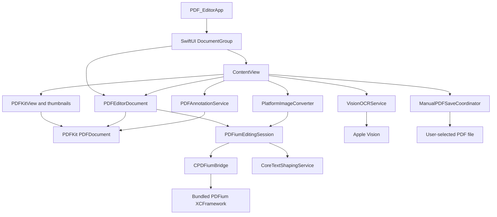

# PDF Editor Technical Documentation

## 1. System overview

PDF Editor is a SwiftUI `DocumentGroup` application for iOS, iPadOS, and macOS. `PDFEditorDocument` is the document-lifecycle and mutation owner, while explicit cross-platform saving is coordinated separately from edit-time UI observation. The normal path uses:

- PDFKit for document presentation, selection, thumbnails, annotations, and a secondary in-memory view of the current bytes.
- A local `PDFiumBridge` Swift package for the primary editing session and page-object mutations.
- CoreText for complex or missing-glyph replacement text overlays.
- Vision for on-device text recognition.
- ImageIO for bounded, orientation-aware image decoding.

The app has no reviewed first-party networking, account, cloud-sync, analytics, or backend path. That is a source observation, not runtime proof that the bundled native library never performs I/O.

### Runtime status

| Path | Status | Notes |
| --- | --- | --- |
| `PDF_EditorApp` → `DocumentGroup` → `PDFEditorDocument` → `ContentView` | Implemented | Normal application composition. |
| `PDFEditorDocument` → `PDFiumEditingEngine` | Implemented | Primary editing path for new and unlocked documents. |
| PDFKit display and annotation mutation | Implemented | Page/object operations refresh the visible document from serialized editing-session bytes. Successful annotation mutations preserve the current PDFKit document identity while synchronizing and verifying the PDFium session; rollback and Undo/Redo rebuild from serialized bytes. |
| Explicit save | Implemented | macOS and iOS expose a Save toolbar action; macOS also replaces File → Save and Command-S with the same action. Inline text edits remain in a `PendingTextEditStore` until Save; edit-time refreshes do not publish a new `ReferenceFileDocument` snapshot. |
| Vision OCR | Implemented, optional | Invoked only from the OCR menu. Recognition results require user review before text-layer insertion. |
| `PDFKitEditingEngine` as a complete backend | Experimental / inactive | Not selected as the document's normal engine. It is used internally for metadata mutation. |
| Full page-order and metadata UI | Inactive | Commands exist in the engine surface, but `ContentView` does not expose them directly. |
| Remote or hosted service mode | Not implemented | No configuration or adapter exists in the reviewed source. |

## 2. Architecture

The app separates platform-neutral editing commands from concrete PDF engines. The document object coordinates PDFium, PDFKit, persisted/working bytes, and undo; `ContentView` and `ManualPDFSaveCoordinator` own explicit save initiation and file replacement.



### Layers and dependency direction

1. **Application composition**: `PDF_EditorApp.swift` creates a `DocumentGroup` and injects each `PDFEditorDocument` into `ContentView`.
2. **Presentation**: `ContentView.swift` and `FeatureViews.swift` own transient UI state, the hidden-by-default Tools panel, Comment List, explicit Save action, and document operations. `PDFKitView.swift` bridges SwiftUI to `PDFView` on AppKit and UIKit.
3. **Document coordination**: `PDFEditorDocument.swift` owns source bytes, the last explicitly persisted bytes, the PDFium session, the PDFKit display document, password authorization, save policy, signature consent, and Undo registration.
4. **Core abstraction**: `PDFEditingEngine.swift` defines platform-neutral metadata, page commands, results, errors, and the engine/session protocols.
5. **Concrete engines**: `PDFiumEditingEngine.swift` is primary. `PDFKitEditingEngine.swift` is a limited alternate implementation and a metadata helper.
6. **Services**: Coordinated manual file replacement, OCR, CoreText shaping, image conversion, and annotation logic are isolated services but are constructed directly rather than injected.
7. **Native bridge**: the `CPDFiumBridge` C target adapts Swift-compatible functions to the bundled PDFium C API and locally patched object-editing functions.

### Composition and lifecycle ownership

- SwiftUI owns the `ReferenceFileDocument` lifecycle, but normal edits notify a nested `EditorState` rather than the document object's publisher. Its snapshot remains the last explicitly persisted bytes until Save succeeds.
- `PDFEditorDocument` owns an optional, lazily created `any PDFEditingSession` and the corresponding PDFKit `PDFDocument` used by the UI. Initial display does not wait for creation of the mutation session.
- `PDFiumEditingSession` owns one opaque C document handle. It closes the handle on deinitialization.
- `PDFiumRuntime.shared` initializes the PDFium library once and destroys it when the process-level singleton is deinitialized.
- `ContentView` owns OCR tasks. A new document-wide OCR run cancels the previous one, and view disappearance cancels the active batch task.
- `PDFKitView.Coordinator` owns notification observers, gesture recognizers, selection overlays, and the current gesture interaction state.
- `ContentView` owns a cancellable page-object load task, a revision-scoped per-page cache, and an observable pending-text store. The current page is inspected on an independent background PDFium session and the next page is prefetched.
- A process-wide recursive lock in `PDFEditorDocument` serializes PDFium inspection, mutation, export, and annotation-color access across foreground and background handles.

There is protocol-based engine separation, but no application-level dependency-injection container. `PDFEditorDocument` constructs `PDFiumEditingEngine` directly, and `ContentView` constructs its services directly.

## 3. Project structure

### Application source

| Path | Responsibility |
| --- | --- |
| `PDF Editor/PDF_EditorApp.swift` | Application entry point and document scene. |
| `PDF Editor/ContentView.swift` | Main editor UI, hidden/toggleable Tools panel, Comment List integration, explicit Save toolbar action, imports/exports, OCR workflow, protected merge flow, and transient view state. |
| `PDF Editor/FeatureViews.swift` | English tool panels, Comment List, protected-PDF password sheet, OCR result views, object inspector, signature pad, and annotation inspector. |
| `PDF Editor/Core/PDFEditingEngine.swift` | Engine/session protocols, page command model, metadata model, export policy, and shared errors. |
| `PDF Editor/Core/PDFiumEditingEngine.swift` | Primary page and page-object engine, native handle management, verification, rollback, permissions, text fallback, images, and annotation-color bridge. |
| `PDF Editor/Core/PDFKitEditingEngine.swift` | Page-level PDFKit implementation and metadata mutation helper. |
| `PDF Editor/Core/PDFAnnotationModel.swift` | Annotation references, kinds, colors, snapshots, and partial updates. |
| `PDF Editor/Document/PDFEditorDocument.swift` | Persisted/working byte separation, active engine, PDFKit refresh, unsaved-state tracking, mutation transaction boundary, Undo/Redo, security options, OCR insertion, and annotation round-trip verification. |
| `PDF Editor/Document/PDFExportDocument.swift` | `FileDocument` wrapper for split/export bytes and preferred filenames. |
| `PDF Editor/Platform/PDFKitView.swift` | AppKit/UIKit `PDFView` bridge, selection synchronization, and direct object/annotation manipulation overlays. |
| `PDF Editor/Platform/PageThumbnailView.swift` | PDFKit thumbnail rendering for the page sidebar. |
| `PDF Editor/Services/CoreTextShapingService.swift` | Font coverage analysis, complex-script detection, and CoreText PDF overlay creation. |
| `PDF Editor/Services/ManualPDFSaveCoordinator.swift` | Security-scoped, `NSFileCoordinator`-protected replacement writes plus the focused macOS File → Save command. |
| `PDF Editor/Services/PDFAnnotationService.swift` | Annotation creation, resolution, mutation, geometry transformation, snapshotting, and verification. |
| `PDF Editor/Services/PlatformImageConverter.swift` | ImageIO decode, size limiting, orientation handling, BGRA conversion, and alpha unpremultiplication. |
| `PDF Editor/Services/VisionOCRService.swift` | Selectable-text policy, rendering, Vision recognition, batch processing, and rotation-aware coordinate conversion. |

### Local package and validation

| Path | Responsibility |
| --- | --- |
| `Packages/PDFiumBridge/Package.swift` | Local Swift package manifest, binary target, C bridge target, and XCTest target. |
| `Packages/PDFiumBridge/Sources/CPDFiumBridge/` | Public C surface and implementation wrapping PDFium. |
| `Packages/PDFiumBridge/Vendor/PDFium.xcframework` | Checked-in PDFium binaries for iOS device, Simulator, Mac Catalyst, and macOS. |
| `Packages/PDFiumBridge/Vendor/Fork/` | Reproduction notes and two local PDFium patches. |
| `Packages/PDFiumBridge/Tests/CPDFiumBridgeTests/` | Package-level native bridge regression suite. |
| `Validation/` | Standalone fixture generators and validation programs; not an Xcode test target. |
| `RELEASE_CHECKLIST.md` | Pending automated, manual, licensing, signing, and distribution checks. |
| `THIRD_PARTY_NOTICES.md` | Dependency notice index. |

## 4. Data flows

### 4.1 Open, unlock, edit, save

1. SwiftUI supplies file bytes to `PDFEditorDocument.init(configuration:)`.
2. PDFKit first validates that the bytes form a PDF.
3. An unlocked document initially keeps only its source bytes and PDFKit document; its mutation session is created lazily on the first operation that requires it. A locked document retains source bytes and creates the session only after a valid password is supplied.
4. `ContentView` immediately displays `PDFEditorDocument.pdfDocument` in `PDFKitView`. Page-object inspection runs on an independent background PDFium handle, caches the current page, and then prefetches the next page without blocking PDFKit presentation or scrolling.
5. A mutation passes through `PDFEditorDocument.mutate`:
   - serialize and retain the current bytes;
   - reject the mutation when signature objects exist and consent has not been granted;
   - invoke the PDFium/PDFKit mutation;
   - serialize the result and synchronize the editing session; page/object mutations refresh the PDFKit display document, while successful annotation mutations retain its existing identity;
   - restore the prior bytes if the operation or refresh fails;
   - register Undo using the prior serialized bytes.
6. `EditorState` publishes the refreshed display revision and marks the working document unsaved. `PDFEditorDocument.objectWillChange` is not emitted for ordinary edits, and `snapshot(contentType:)` continues returning `persistedData`, the last explicitly saved bytes.
7. Leaving an inline text editor records or removes a `PendingTextEdit` in `PendingTextEditStore`; it does not invoke PDFium. The store registers symmetric Undo/Redo actions with the focused SwiftUI document `UndoManager`. The Save toolbar action on macOS or iOS, or File → Save/Command-S on macOS, first applies pending text replacements in deterministic page/path order, removes their store-owned Undo actions after successful application, and then asks the editing session for bytes using the preserve-security or remove-security policy.
8. An existing file is replaced through `ManualPDFSaveCoordinator`, which uses security-scoped access, `NSFileCoordinator`, and an atomic `Data.write`. A new document uses SwiftUI's PDF file exporter to obtain its first URL.
9. Only after the write or export succeeds does `markManuallySaved(data:)` advance `persistedData`, update `sourceData`, and clear the unsaved flag.

The in-memory `sourceData` supports unlock and rollback bookkeeping. Non-text working edits remain in the PDFium/PDFKit session, while inline text edits remain in `PendingTextEditStore.edits` until Save applies them. Neither path writes to disk until an explicit Save succeeds.

### 4.2 Page operations

- Insert, delete, rotate, move, reorder, and merge execute in the PDFium session.
- Page-assembly mutations require PDF permission bit `0x400`.
- Each mutating native call is followed by serialization, handle replacement, and a narrow verification such as page-count, size, or rotation equality.
- Split is nonmutating with respect to the open document. It validates nonoverlapping zero-based ranges, copies selected pages into new PDF bytes, and verifies the expected page count after reopening without a password.
- The UI exports either one selected-page document or one document per page through SwiftUI file exporters.

### 4.3 Page-object inspection and editing

1. The bridge recursively walks page objects and returns an index path such as `[topLevelIndex, nestedIndex, ...]`.
2. `PDFPageObjectSnapshot` exposes type, bounds, composed transform, fill color, text/font properties, optional embedded font data, and image pixel size where applicable. Object enumeration copies each distinct page font once and shares the resulting `Data` value among snapshots using that font.
3. The UI can target an object through the inspector or the `PDFKitView` overlay.
4. Translate, transform, z-order, delete, add, and replace operations snapshot the pre-mutation data.
5. The session serializes and reopens after mutation, verifies the intended property, and restores prior bytes on failure.

The locally patched PDFium path clones Form ancestors before editing nested descendants. This copy-on-write behavior is designed to avoid changing other placements of a shared Form XObject. It is test-covered in the package suite; runtime behavior in this documentation task is recorded in the verification section.

### 4.4 Text replacement

1. Background page inspection copies each distinct embedded font once for inline display. Save-time replacement also retrieves the selected object's original font data directly from the editing session.
2. `CoreTextShapingService.analyze` checks whether that font maps all UTF-16 code units to nonzero glyphs and whether the text contains combining marks or script ranges treated as requiring advanced shaping.
3. Infer the original bold/italic state from the PDF font name. When that state is unchanged, the font covers the text, and advanced shaping is not required, replace the text in the existing object, serialize/reopen, and verify the normalized copied text.
4. When bold/italic state changes, or the normal font/shaping checks require fallback:
   - generate a one-page CoreText PDF overlay using the original embedded font when it covers the replacement but requires advanced shaping, or the bundled Noto font when original glyph coverage is insufficient;
   - synthesize bold with Core Graphics fill-and-stroke text drawing and italic with a text-matrix shear because the bundled fallback currently contains only a regular font face;
   - replace the original object's visible text with a space;
   - import the overlay as a Form object with ActualText metadata;
   - serialize/reopen and verify that PDFKit search, page text, or page-object inspection can find the semantic replacement text.
5. If page regeneration would materially change ICC or pattern color, create an opaque PDFKit FreeText replacement. Its visual size is capped to the original object's page-space height; it uses the embedded font when available and applies the requested platform bold/italic traits where supported.
6. Any failure restores the original bytes.

On macOS, committing an existing-text inline edit keeps the first staged edit visible through an atomic live-editor-to-page-overlay handoff. If that page's overlay has not mounted yet, the live editor and its mask are retained only as a short-lived, noninteractive fallback; the fallback is removed when the mounted overlay takes over and is also removed on scrolling or document replacement. The original-text mask is aligned outward to complete backing-pixel boundaries without fixed point padding, so its coverage avoids a vertical seam. This presentation-only handoff does not mutate the PDF or persist bytes. On iOS, committing inline text likewise stages the change only; it does not auto-save.

The fallback is a new searchable vector layer, not preservation of the original PDF text object's font and internal encoding.

### 4.5 Image import and replacement

1. SwiftUI restricts the picker to `UTType.image` and reads the selected security-scoped URL only for the duration of import.
2. ImageIO creates an orientation-correct thumbnail capped at 8,192 pixels on the longest dimension.
3. The converter validates dimensions and allocation arithmetic, renders into sRGB BGRA8, detects alpha, and converts premultiplied RGB components back to independent RGB expected by the bridge.
4. PDFium inserts or replaces the bitmap.
5. The session serializes/reopens and verifies object count, object kind, transform preservation, and pixel dimensions as appropriate.

### 4.6 Annotation flow

- PDFKit creates notes, free text, highlights, and ink signatures.
- Annotation and page-object selection are simultaneously available without toolbar mode switches. Comment placement takes precedence, followed by annotation hit testing and then page-object hit testing; selecting one target clears the other.
- A single click or tap selects a page object for movement and transforms. Object hit testing converts bounds into view coordinates and applies a six-point screen-space tolerance. On macOS, custom hit testing captures only left-mouse-down events; scroll-wheel and trackpad events continue to the PDFKit hierarchy so the document can scroll from its central content area. A double-click on macOS or double-tap on iOS activates type-specific editing: text receives a borderless native text field positioned over its converted page bounds, while images open the replacement importer. Pending macOS text is rendered in a transparent, non-editable text view above a mask restricted to the original PDF object bounds. The text view expands to its multi-line layout height for hit testing and copying. A staged double-click maps the glyph hit to a UTF-16 word-start index and places a zero-length insertion cursor there when the editable text view gains focus; the editor also expands and shrinks with explicit line breaks. Its private Undo history is discarded and first responder is returned to the PDF view before removal, while committed pending replacements use the document environment's Undo manager. Return/Done or clicking outside stages inline text for the next Save; Escape cancels on macOS. Note comments retain their single-click editor behavior, while FreeText annotations can be edited again in place.
- Add a comment uses a cross-platform sheet with a focused multi-line `TextEditor`, replacing the size-constrained alert text field.
- Edit comment in the left Tools panel opens a page-scoped Comment List. Wide layouts place it beside the Tools panel; compact layouts present it as a sheet. It reuses the same annotation editor for content, color, opacity, font size, line width, selection, and deletion.
- Annotation identity is a page index plus annotation-array index, not a persistent PDF object identifier.
- Update validation enforces minimum 4-point bounds, 6–144 point font sizes, and 0.5–24 point ink widths.
- Moving or scaling ink and highlight annotations transforms their path or quadrilateral geometry with their bounds.
- Fixed appearance streams allow geometry/content handling but reject style changes.
- After a PDFKit annotation mutation, the document serializes and opens a new PDFium session, applies annotation color through the native bridge when safe, serializes again, and verifies kind, contents, bounds, color, font size, line width, and geometry point count. The successful path retains the visible `PDFDocument` instance to avoid an Apply-time flash; failed mutations restore prior bytes and Undo/Redo continue to rebuild the display document.

Because references use annotation-array indices, mutations are applied and verified synchronously against the current document. There is no migration or stable-ID layer for external annotation references.

### 4.7 OCR flow

1. `VisionOCRService` treats any page with nonempty `PDFPage.string` as already containing selectable text and skips recognition for that page.
2. A page requiring OCR is rendered from its crop box. Its longest rendered dimension is scaled to at least the page's point size and normally up to 3,000 pixels.
3. `VNRecognizeTextRequest` uses accurate recognition, language correction, and automatic language detection in a detached user-initiated task.
4. Vision normalized rectangles are mapped back into PDF page coordinates with explicit 0°, 90°, 180°, and 270° mappings.
5. Single-page results are displayed before insertion. Batch recognition runs sequentially, reports progress, separates recognized, skipped-text, and empty pages, and presents a summary.
6. Only after confirmation does the document embed the bundled font and add invisible text objects at recognized bounds.
7. The insertion path rechecks that target pages still lack selectable text and rejects duplicate or invalid page indices.

Cancellation is checked before rendering, inside the detached recognition task, between batch pages, and before presenting batch results. Cancellation before confirmation leaves the PDF untouched.

## 5. Core components

### `PDFEditorDocument`

- **Inputs**: file bytes, passwords, editing commands, page-object/annotation operations, OCR observations, save policy.
- **Outputs**: PDFKit display document, nested editor revision/unsaved state, explicit-save bytes, metadata properties, split documents, typed errors.
- **Dependencies**: PDFKit, `PDFiumEditingEngine`, `PDFAnnotationService`, bundled font, SwiftUI document APIs, UndoManager.
- **Ownership**: active session, display document, source bytes, last explicitly persisted bytes, authorized password, signature-consent flag, save security flag.

It is the mutation transaction boundary. Presentation code does not own native PDFium handles; `ContentView` requests explicit-save bytes and delegates existing-file replacement to `ManualPDFSaveCoordinator`.

### `PDFiumEditingSession`

- Implements `PDFEditingSession`, `PDFObjectEditingSession`, and `PDFAnnotationEditingSession`.
- Converts Swift command data to C bridge calls.
- Validates indices, ranges, dimensions, bitmap layouts, and page order.
- Reopens serialized bytes after changes and rolls back local handles when verification fails.
- Delegates metadata mutation to `PDFKitEditingSession`.

### `PDFKitEditingSession`

- Provides the same page-command protocol with PDFKit operations.
- Checks `allowsDocumentChanges` for metadata and `allowsDocumentAssembly` for page operations.
- Retains detached one-page documents because PDFKit pages retain their backing documents weakly.
- Can rebuild an unlocked document without its encryption dictionary and verifies that result.

It is not the normal application backend.

### `PDFKitView.Coordinator`

- Synchronizes selected page and PDF text selection with SwiftUI bindings.
- Observes `PDFView` page, selection, and scale changes.
- Performs hit testing against object or annotation snapshots.
- Displays shape-layer selection handles.
- Converts drag, scale, and rotation gestures into page-space object transforms or annotation bounds.
- Enables platform-specific gesture recognizers while keeping the high-level behavior shared.

### Native C bridge

The public header exposes opaque document/font references and operations for:

- lifecycle, page counts, encryption, permissions, and signature count;
- page insertion, deletion, rotation, movement, import, copy, and serialization;
- recursive page-object paths and object metadata;
- text, transform, z-order, deletion, image, overlay, and embedded-font operations;
- annotation color access.

Allocated output buffers cross the C boundary with explicit `PEPDFFree` ownership.

## 6. Data models and state

### Domain and bridge-neutral models

- `PDFDocumentInfo`: optional title, author, subject, creator, keywords, creation date, and modification date.
- `PDFDocumentMetadata`: page count, encryption/lock state, and document info.
- `PDFPageRange`: inclusive zero-based bounds.
- `PDFPageSize`: width/height in PDF points, with Letter and A4 constants.
- `PDFEditingCommand`: page and metadata operations.
- `PDFEditingCommandResult`: updated metadata or split output bytes.
- `PDFExportOptions`: preserve or remove security after authorized unlock.

### Page-object models

- `PDFPageObjectPath` stores recursive sibling indices.
- `PDFPageObjectSnapshot` stores inspection data and optional shared embedded-font bytes; it is a value snapshot, not a live object.
- `PDFBitmapPayload` stores validated BGRA data and geometry.
- `PDFInvisibleTextItem` carries semantic text and a PDF-space rectangle.

### Annotation models

- `PDFAnnotationReference` is positional: page index and annotation index.
- `PDFAnnotationSnapshot` contains kind, bounds, contents, primary/font colors, font size, line width, geometry count, and appearance-stream status.
- `PDFAnnotationUpdate` is a partial update with optional fields.

### View state

`ContentView` holds transient state for selected page/text/object/annotation, revision-scoped page-object cache/loading, the observable `PendingTextEditStore`, comment placement, Tools/Comment List visibility, save URL/export progress, sheets and alerts, import purpose, split exports, pending protected merge bytes, OCR task/progress/results, draft text, and errors. Direct object and annotation selection remain continuously available outside comment placement. This state is neither persisted nor versioned by application code.

### Persistence and storage boundaries

- `ReferenceFileDocument.snapshot(contentType:)` exposes only `persistedData`; ordinary edits update the nested observable `EditorState` and do not advance that snapshot.
- Existing PDFs are written only by an explicit Save through coordinated atomic replacement. A new document's first Save uses a SwiftUI file exporter, after which later Saves target the selected URL.
- Committed document mutations use complete serialized PDF `Data` snapshots for Undo/Redo. Pending inline replacements use value-level store actions until Save applies them.
- Passwords and pending protected-merge bytes are held in memory for the active view/document.
- No database, cache directory, UserDefaults schema, Keychain item, cloud state, migration, or application data-version field exists.
- The bundled PDFium and font are immutable app resources from the application's perspective.

## 7. Important logic and edge cases

### Validation and fail-closed mutation

- Page and insertion indices use distinct closed/open bounds.
- A PDF cannot delete its last page.
- Rotation must be a multiple of 90 degrees.
- Reorder input must contain every page exactly once.
- Split ranges must be in bounds and nonoverlapping.
- Page sizes and transforms must contain finite, positive dimensions where required.
- Bitmap sizes and stride arithmetic are checked before crossing into C.
- Most native mutations retain prior bytes and restore them if the native call, serialization, reopen, or postcondition fails.

Verification is operation-specific rather than a complete semantic diff. For example, page movement verifies the page count, while package tests provide deeper order assertions.

### Form XObject isolation

Recursive paths allow mutation below Form XObjects. Local PDFium patches implement copy-on-write cloning of Form ancestors and isolated image replacement so mutation of one placed instance does not intentionally modify another shared instance. The package tests cover shared page/Form images, nested text, transformations, z-order, deletion, clipping, and marked content.

### Font and shaping policy

The original font is used only when glyph mapping succeeds and the text is not in the explicit advanced-shaping categories/ranges. The range check is a conservative heuristic, not a complete Unicode shaping classifier. The normal fallback uses a one-line CoreText overlay and semantic search verification; it is not a general paragraph-layout engine. Before accepting a PDFium rewrite, the bridge renders color metrics before mutation and after serialization/reopening. If regeneration would substantially discard ICC or pattern color, the transaction rolls back and `PDFEditorDocument` creates an opaque PDFKit FreeText visual replacement without regenerating the page content. The annotation remains directly editable, but the original content-stream text remains underneath and may still be returned by search.

### OCR scaling and warm-up

There is no model warm-up or application-managed OCR cache. The longest side is scaled with `max(1, 3000 / longestSide)`, so small pages are enlarged and pages already longer than 3,000 points are not downscaled below their point dimensions. Pages are processed sequentially with no retry or backoff.

### Image limits

ImageIO enforces an 8,192-pixel thumbnail cap, but memory use can still be material because decoded data uses four bytes per pixel. There is no cross-import cache or capacity scheduler.

### Concurrency and stale state

- Batch OCR and background page-object inspection are explicit long-running task paths.
- Starting a batch cancels the previous batch; disappearance also cancels it.
- Changing page cancels the prior object-load task, rejects results whose page or document revision is stale, caches the requested page, and prefetches at most the next page. Cancellation cannot interrupt a native PDFium call already executing, so stale native work may finish but its result is discarded.
- PDFium access is serialized across background inspection and foreground mutation because the library is not treated as thread-safe.
- The source `PDFDocument` is passed to sequential recognition and the document is mutated only after review.
- There is no document revision token between recognition and insertion. The insertion path mitigates staleness by validating page indices, rejecting duplicate pages, and refusing pages that now contain selectable text, but it does not prove that page ordering or rendered content is unchanged.

### Retry, rate limiting, and caching

No external requests exist in reviewed source. Accordingly, there is no network retry, exponential backoff, rate limiting, ETag/cache invalidation, session renewal, or provider deduplication implementation. Mutation recovery is local byte rollback rather than retry.

### Time and locale

Annotation modification dates use `Date()` and PDF document metadata can carry creation/modification dates. There is no timezone normalization, business-session logic, or locale-specific parsing. UI strings are hard-coded English literals.

## 8. External dependencies

| Dependency | Version/source | Required | Purpose | Verification boundary |
| --- | --- | --- | --- | --- |
| SwiftUI and Apple document APIs | Xcode SDK; no independent version pin | Required | App lifecycle, UI, document open/new flow, first-save export, focused commands, sheets, alerts, Undo integration | Compile-time availability is build-verifiable; UI behavior needs runtime/manual testing. |
| PDFKit | Apple SDK | Required | Display, selection, annotations, metadata helper, search verification | Source-integrated; complex PDF compatibility requires corpus/runtime testing. |
| Vision | Apple SDK | Optional feature | Local OCR | Source-integrated; recognition quality and language behavior require real documents/devices. |
| CoreText/CoreGraphics | Apple SDK | Required for fallback/OCR layers | Font analysis and vector PDF overlay generation | Testable with included corpus, but not all scripts/fonts/layouts are covered. |
| ImageIO | Apple SDK | Optional image feature | Decode and normalize imported images | Source-integrated; full format compatibility depends on platform codecs. |
| PDFium | `chromium/7811`, revision `9e5d491ff73630b6a423689698290650050e7b3f`; framework version `144.0.7811` | Required | Primary PDF editing and serialization | Checked-in hashes can be compared with notices; upstream provenance, reproducibility, vulnerabilities, signing, and runtime behavior need separate verification. |
| Local PDFium patches | `pdfium-form-xobject-cow.patch`, `pdfium-phase3-object-editing.patch` | Required by current bridge behavior | Nested Form isolation and object editing | Patch files and test coverage exist; rebuilding the framework is a separate toolchain workflow. |
| Noto Sans CJK TC Regular | Bundled OTF; SIL OFL 1.1 | Required for Unicode fallback/OCR insertion | Embedded searchable Unicode text | License file exists; final bundle license exposure remains release work. |

PDFium is an official open-source PDF engine, but this repository uses a checked-in build with local patches rather than a remotely resolved official binary artifact. There are no unofficial web endpoints or third-party service APIs.

## 9. Configuration

### Xcode target

- Project and scheme: `PDF Editor`.
- Product type: application.
- Debug and Release configurations.
- App version: 1.1.1.
- Build number: 20260824.
- Bundle identifier: `com.sunny.pdf-editor`.
- Supported app platforms: `iphoneos`, `iphonesimulator`, and `macosx`.
- Targeted iOS device families: iPhone and iPad.
- iOS and macOS deployment targets: 26.0.
- Swift language version: 5.0.
- Default actor isolation: MainActor; approachable concurrency and upcoming member-import visibility are enabled.
- App Sandbox and Hardened Runtime build settings: enabled.
- User-selected files entitlement setting: read/write.
- Automatic code signing and a checked-in development-team setting.

No explicit `.entitlements` file is present. Generated entitlements in a built signed product were not inspected when drafting this section.

### Document registration

`PDF Editor/Info.plist` registers `com.adobe.pdf` as an Editor document type, uses alternate handler rank, and permits opening in place. Build settings additionally request document-browser support and opening documents in place.

### Local package

`PDFiumBridge` declares Swift tools 5.9, iOS 17, and macOS 14. It contains a binary target at `Vendor/PDFium.xcframework`, one C target, and one XCTest target. The app's higher deployment targets govern the app product.

### Environment and secrets

No environment variables, feature-flag files, runtime modes, API keys, secret files, certificates, backend hosts, or `.env` examples were found. PDF passwords are runtime user inputs, not environment configuration.

## 10. Error handling and logging

### Error surfaces

- `PDFEditingError` covers invalid documents/passwords, locks, permissions, indices, sizes, rotations, page orders/ranges, page failures, export failures, and signature consent.
- `PDFObjectEditingError` covers object inspection/mutation, unsupported text, invalid types/bitmaps, and replacement verification.
- `PDFAnnotationServiceError` covers empty input, missing selection/annotation, unsafe appearance streams, invalid bounds, and round-trip failure.
- `VisionOCRError` covers rendering, existing text layers, missing font resources, and invalid page indices.
- CoreText shaping has explicit font/PDF creation errors.

`ContentView` presents most failures in a generic operation alert using localized error descriptions. Protected merge keeps its error in the sheet and clears the password field after an attempt. Signature consent uses a dedicated warning and requires the user to retry the original mutation.

Explicit replacement saves propagate file-coordination or atomic-write errors to the same operation alert and retain the unsaved working state. Cancelling the first-save exporter is treated as cancellation rather than an error and also leaves the document unsaved.

### Recovery

- PDFium mutations commonly serialize prior bytes and restore the handle on failure.
- `PDFEditorDocument.mutate` adds a second document-level rollback boundary and refreshes PDFKit after restoration.
- Undo/Redo uses whole-document byte snapshots.
- OCR cancellation is handled separately and does not insert text before review.

There is no automatic retry, retry limit, or backoff because there is no remote service path and native mutation failures are treated as unsafe to repeat automatically.

### Logging and redaction

No application logger, OSLog calls, analytics, or production diagnostic upload is implemented. Standalone validation programs print only status and fixture paths. Errors shown to the user can contain platform-localized descriptions. There is no centralized redaction layer because the app does not intentionally log passwords or document contents.

The absence of first-party logging does not establish behavior inside Apple frameworks or the bundled PDFium binary.

## 11. Security and privacy

### File access

- Build settings enable the App Sandbox and read/write access to user-selected files.
- Imports use `startAccessingSecurityScopedResource()` and stop access after reading.
- SwiftUI retains the document open/new lifecycle and first-save exporter. Existing-file persistence is an explicit security-scoped, file-coordinated replacement initiated from Save.

These are source/build-setting facts. Sandbox enforcement, final entitlements, signing, notarization, and distribution behavior require inspection of the built signed application.

### Passwords and encryption

- Password fields use `SecureField`.
- A successfully accepted main-document password is retained in `PDFEditorDocument` and `PDFiumEditingSession` memory so serialized encrypted data can be reopened during mutation and Undo/Redo.
- A protected merge password is held in transient view state and cleared after success or failure.
- No deliberate file, UserDefaults, database, or Keychain persistence of passwords was found.
- There is no secure-memory allocation, memory locking, or explicit zeroization guarantee.
- Explicit Saves request security preservation by default.
- Password removal requires separate confirmation for an unlocked encrypted document. PDFium uses `FPDF_REMOVE_SECURITY`, and the output is rejected if PDFKit still reports it encrypted.
- The removal flag persists for the open document until the user disables it; it is not automatically reset after one save.
- Split documents are newly assembled outputs opened without a password, so they are not governed by the save-time password-removal confirmation.

### PDF permissions

PDFium-backed insertion, deletion, rotation, movement, reordering, and merge operations check permission bit `0x400` before page assembly. This is not a general editing-permission guarantee: no equivalent explicit permission guard was found in the reviewed PDFium object- or annotation-mutation paths. Whether PDFium or PDFKit independently rejects those mutations has not been established by restricted-document runtime testing. Metadata mutation is distinct and checks PDFKit's `allowsDocumentChanges`.

### Digital signatures

The editor checks whether PDFium reports one or more signature objects. It requires confirmation before the first in-place mutation, then permits signature-invalidating mutations for the remaining lifetime of that open `PDFEditorDocument`. The consent is not per operation or per save. Split is derived-output generation and bypasses the mutation gate.

This is presence detection only. The app does not validate signer identity, certificate chains, trust, signed byte ranges, timestamps, or cryptographic signature validity.

### Network and identity

No first-party URLSession, WebView, authentication, account, analytics, telemetry, APNs, App Attest, cloud storage, Keychain, or network-provider implementation was found. No privacy manifest was found. Do not interpret this as verified runtime network isolation or privacy-manifest compliance.

### Native dependency and distribution

The four checked-in PDFium Mach-O hashes can be compared with `Packages/PDFiumBridge/Vendor/NOTICE.md`. Matching hashes prove consistency with that repository record only; they do not independently prove upstream provenance, reproducibility, vulnerability status, complete notices, or that the final app embeds the intended signed slices.

The app opens encrypted PDFs and can remove their encryption dictionary. Export-control classification and store declarations are externally unverified and must be assessed for the intended binary and distribution channel. No `ITSAppUsesNonExemptEncryption` declaration exists in the reviewed configuration.

## 12. Testing and validation

### Test-covered code

`Packages/PDFiumBridge/Tests/CPDFiumBridgeTests/PDFiumBridgeTests.swift` contains XCTest coverage for:

- annotation color and opacity round trips;
- existing-text rewrite and style/geometry preservation;
- object movement, addition, deletion, transformation, and z-order;
- Unicode searchable layers and multilingual regular/bold/italic CoreText overlays;
- bitmap insertion/replacement and alpha handling;
- shared image and nested/shared Form isolation;
- clipping and marked-content preservation;
- page insert/delete/rotate/move/reorder/split/merge;
- password acceptance/rejection, encryption preservation, and authorized removal;
- a 120-page workflow and malformed/truncated input rejection.

The tests exercise the local package and native bridge. They do not launch the app UI.

### Standalone validations

- `AnnotationRoundTrip.swift`: creates and modifies note, free-text, ink, and highlight annotations and verifies serialization/reopen properties.
- `OCRPolicyValidation.swift`: confirms that image-only pages require OCR and pages with real PDF text are skipped.
- `MakePDFEditorFixtures.swift`: produces nested-Form and top-level-text fixtures.
- `MakePhase5ProtectedFixture.swift`: produces and verifies a password-protected fixture.
- `PhaseSixCorpus.swift`: produces 120-page, mixed-content, rotated, protected, and truncated PDFs.
- `PhaseSixAcceptance.swift`: checks that generated corpus with PDFKit and the OCR skip policy.

These files are not part of a test target. Some create temporary fixtures and must be compiled with the relevant application source files.

### Commands

Package tests:

```sh
swift test --package-path Packages/PDFiumBridge
```

Application builds:

```sh
xcodebuild -project "PDF Editor.xcodeproj" -scheme "PDF Editor" -destination 'platform=macOS' -derivedDataPath /tmp/PDFEditorDerivedData-mac CODE_SIGNING_ALLOWED=NO build
xcodebuild -project "PDF Editor.xcodeproj" -scheme "PDF Editor" -destination 'generic/platform=iOS Simulator' -derivedDataPath /tmp/PDFEditorDerivedData-iossim CODE_SIGNING_ALLOWED=NO build
xcodebuild -project "PDF Editor.xcodeproj" -scheme "PDF Editor" -destination 'generic/platform=iOS' -derivedDataPath /tmp/PDFEditorDerivedData-ios CODE_SIGNING_ALLOWED=NO build
```

Standalone validation commands that were actually successful in this documentation task are listed under “Verified in this task” below. The repository does not provide a wrapper script or CI job for them.

Annotation round trip:

```sh
xcrun swiftc -parse-as-library Validation/AnnotationRoundTrip.swift "PDF Editor/Core/PDFAnnotationModel.swift" "PDF Editor/Services/PDFAnnotationService.swift" -o /tmp/PDFEditor-AnnotationRoundTrip
/tmp/PDFEditor-AnnotationRoundTrip
```

OCR policy:

```sh
xcrun swiftc -parse-as-library Validation/OCRPolicyValidation.swift "PDF Editor/Services/VisionOCRService.swift" -o /tmp/PDFEditor-OCRPolicyValidation
/tmp/PDFEditor-OCRPolicyValidation
```

Protected fixture self-validation:

```sh
xcrun swiftc Validation/MakePhase5ProtectedFixture.swift -o /tmp/PDFEditor-MakePhase5ProtectedFixture
/tmp/PDFEditor-MakePhase5ProtectedFixture
```

Phase-six corpus and acceptance:

```sh
xcrun swiftc Validation/PhaseSixCorpus.swift -o /tmp/PDFEditor-PhaseSixCorpus
xcrun swiftc -parse-as-library Validation/PhaseSixAcceptance.swift "PDF Editor/Services/VisionOCRService.swift" -o /tmp/PDFEditor-PhaseSixAcceptance
/tmp/PDFEditor-PhaseSixCorpus /tmp/PDFEditor-PhaseSixCorpusFiles
/tmp/PDFEditor-PhaseSixAcceptance /tmp/PDFEditor-PhaseSixCorpusFiles
```

### Verified in this task

The following completed successfully on 2026-08-24 with Xcode 26.6 and Apple Swift 6.3.3. A source file or test existing in the repository is not counted here unless its command completed successfully in this task.

- `xcodebuild -list -project "PDF Editor.xcodeproj"` resolved the local package and confirmed the `PDF Editor` target and scheme, Debug/Release configurations, and `PDFiumBridge` scheme.
- `swift test --package-path Packages/PDFiumBridge`: 23 XCTest cases passed with 0 failures.
- Annotation round trip: passed for note, free-text, ink, and highlight geometry/style after serialization and reopen. CoreText emitted informational system-font substitution notes; the validation still exited successfully.
- OCR policy: passed, confirming that an image-only page requires OCR and a page with real PDF text is skipped.
- Protected fixture: successfully created a protected PDF, rejected the wrong password, and accepted the fixture password.
- Phase-six acceptance: passed for a 120-page PDF, mixed text/scanned pages, a rotated page, a protected PDF, and rejected truncated data. CoreGraphics logged an expected parse error while the truncated fixture was being rejected.
- Unsigned Debug macOS build: succeeded with `CODE_SIGNING_ALLOWED=NO` and DerivedData under `/tmp`.
- Unsigned Debug generic iOS Simulator build: succeeded for arm64 and x86_64 with `CODE_SIGNING_ALLOWED=NO` and DerivedData under `/tmp`.
- Unsigned Debug generic iOS device build: succeeded for arm64 with `CODE_SIGNING_ALLOWED=NO` and DerivedData under `/tmp`.
- SHA-256 comparison: all four bundled PDFium binaries matched the values recorded in `Packages/PDFiumBridge/Vendor/NOTICE.md`.

Additional validation completed on 2026-08-25 after the pending-text, Undo, embedded-font, multi-line editor, background-inspection, and scrolling changes:

- `swift test --package-path Packages/PDFiumBridge`: 25 XCTest cases passed with 0 failures.
- Debug macOS build: succeeded with isolated DerivedData under `/tmp`.
- Debug generic iOS Simulator build: succeeded with `CODE_SIGNING_ALLOWED=NO` and isolated DerivedData under `/tmp`.
- `git diff --check`: passed.

The multi-line staged-text builds cover compilation of rendered-height hit testing, UTF-16 cursor placement, isolated inline Undo, and bounded background masks. Their exact pointer targeting, cursor display, Delete-key behavior, and line coverage still require manual macOS UI verification.

Additional validation completed on 2026-08-25 after adding Bold and Italic existing-text formatting:

- `swift test --package-path Packages/PDFiumBridge`: 26 XCTest cases passed with 0 failures, including searchable Bold, Italic, and combined CoreText overlays after PDFium import and reopen.
- Debug macOS build: succeeded with isolated DerivedData under `/tmp/PDFEditorStyledTextMac`.
- Debug generic iOS Simulator build: succeeded for arm64 and x86_64 with `CODE_SIGNING_ALLOWED=NO` and isolated DerivedData under `/tmp/PDFEditorStyledTextIOS`.
- UI interaction, visual weight/slant, exact baseline placement, and Save/reopen appearance still require manual validation on macOS and iOS.

Additional user-validated macOS runtime evidence on 2026-08-25:

- The first committed inline text edit stayed visibly continuous through the live-editor-to-page-overlay handoff, and the backing-pixel-aligned mask showed no vertical seam. This is user-validated visual runtime evidence only; it is distinct from the build results above and does not establish persistence, which remains explicit Save only.

The builds establish compilation and bundle construction for those destinations. They do not establish successful app launch, UI behavior, sandbox enforcement, signing, installation, or document workflow correctness.

### Externally or manually unverified

- Physical iPhone/iPad execution and file-provider behavior.
- Signed macOS application behavior, sandbox enforcement, Hardened Runtime, entitlements, signing, notarization, and App Store behavior.
- Broad manual UI workflows, accessibility text sizes, semantic Undo/Redo verification, save/close/reopen, real password-restricted permission combinations, and visual inspection of generated pages. A scoped macOS comment Apply workflow was manually exercised on 2026-08-25.
- OCR quality on representative scanned documents and all languages/scripts.
- PDFium reproducibility from the recorded source revision and local patches.
- Complete transitive notices, font-license exposure in the final bundle, export-compliance classification, and vulnerability status.

## 13. Known limitations and technical debt

- The app has no app-level unit or UI test target; most automated coverage is below the document/UI layer.
- Standalone validations require manual compile commands and are not orchestrated by CI.
- The repository has no CI, formatter, linter, dedicated static-analysis command, or tool-version file.
- The UI is hard-coded English and lacks checked-in localization resources.
- `PDFEditorDocument` directly constructs engines and services, limiting dependency substitution in app-level tests.
- Whole-document byte snapshots make rollback simple but can consume significant memory for large PDFs and Undo histories.
- Batch OCR is sequential and has no capacity-aware queue, partial checkpointing, or recognition cache.
- OCR stale-task protection checks cancellation and target-page state but has no document revision token.
- Annotation references are array-index based and are not stable across arbitrary external mutations.
- The advanced-shaping detector is a fixed Unicode-range/category heuristic, and the fallback is single-line overlay rendering.
- Object/page postconditions are intentionally narrow; full semantic preservation depends on regression corpora and manual inspection. The appearance-safe FreeText fallback assumes an opaque white background around the replaced text and is therefore not a semantic content-stream rewrite.
- Explicit permission enforcement covers page assembly and PDFKit metadata, but not visibly every object/annotation mutation.
- Signature invalidation consent lasts for the open document rather than one operation.
- Passwords remain in ordinary process memory for the active encrypted-document session.
- The password-removal option remains enabled until manually disabled, and split output has a separate security policy.
- The checked-in development team, bundle identifier, version/build number, and document-handler rank are release-sensitive configuration. `RELEASE_CHECKLIST.md` still marks final selection as pending.
- The bundled PDFium notice set is incomplete for distribution according to repository documentation.
- There is no project-wide license declaration.
- The repository contains generated local package build artifacts under `Packages/PDFiumBridge/.build`; they are not source-of-truth dependency metadata and should not be used to claim a clean reproducible checkout.

## 14. Design decisions

### Protocol boundary around editing engines

Page commands are modeled independently of PDFKit and PDFium. This supports an alternate backend and keeps UI code from calling C APIs directly. The trade-off is that object- and annotation-specific protocols extend beyond the base page command abstraction.

### PDFium mutation with PDFKit presentation

PDFium provides low-level object editing, while PDFKit provides native display, selection, annotation APIs, and SwiftUI interoperability. Serializing and reopening between them creates a clear boundary and enables verification, but it adds CPU/memory cost and exposes compatibility differences between two PDF implementations.

### Fail-closed round-trip verification

Mutations retain prior bytes and verify selected postconditions after serialization. Unsafe or unverifiable results are rejected and rolled back. This prioritizes document integrity over accepting partially successful native mutations.

### Copy-on-write for nested Forms

Local PDFium patches clone Form ancestry before descendant mutations to isolate shared instances. This increases patch maintenance and rebuild burden but avoids edits propagating to unrelated placements.

### Preserve-font then fallback text strategy

The app first attempts an in-place rewrite only when font coverage, shaping policy, and the requested bold/italic state permit it. The CoreText overlay path favors visible correctness and searchability when the original font cannot safely represent the requested text or the style changes. Bold and italic are synthetic for overlay text because only a regular CJK fallback face is bundled. If serialized color metrics show that PDFium regeneration is unsafe, an opaque FreeText annotation replaces the text visually while preserving the original page resources. These fallbacks change the internal object structure, and the color-safety fallback intentionally retains the original underlying text.

### Review-before-write OCR

Recognition produces a result model without mutating the PDF. The user reviews single-page or batch results before insertion, and existing selectable-text pages are skipped. This avoids accidental duplicate text layers but does not offer partial per-observation editing.

### Explicit destructive-security choices

Password removal and signature invalidation require explicit confirmation. Encryption is preserved by default, and mutation is blocked before signature consent. The current consent/save flags are document-lifetime settings rather than one-shot authorizations.

## 15. Future development

The following are recommended extension directions based on existing seams; none is implemented merely by appearing here.

- **Recommended: app-level testability.** Inject `PDFEditingEngine`, OCR, annotation, and image services into `PDFEditorDocument`/`ContentView`, preserving the platform-neutral engine boundary and avoiding native/global dependencies in document tests.
- **Recommended: permission-policy consolidation.** Add a provider-neutral mutation permission policy covering page, metadata, object, and annotation operations, while retaining fail-closed behavior and tests for distinct PDF permission combinations.
- **Recommended: scoped security consent.** Revisit signature-consent lifetime, password-memory handling, password-removal reset behavior, and split-output security policy before release.
- **Recommended: OCR revision safety.** Introduce a document revision token or immutable recognition snapshot so page reordering/content edits can invalidate stale results before insertion.
- **Recommended: validation automation.** Add an app test target or repository script/CI workflow for package tests, standalone validations, unsigned builds, fixture rendering, and Markdown checks without requiring credentials or production services.
- **Recommended: broader layout fallback.** Extend the shaping service behind its existing boundary for multiline layout, bidirectional text, vertical writing, and more complete font fallback while continuing semantic-text verification.
- **Recommended: localization.** Move hard-coded UI strings into a string catalog without changing the editing/domain boundaries.
- **Planned release work:** complete third-party notices, expose required licenses in the final bundle, inspect signed entitlements, decide final signing/distribution settings, assess encryption export compliance, and perform device/manual corpus acceptance.

Any future backend or cloud feature should remain outside the core editing models, avoid placing credentials in the repository, make document transmission explicit to the user, and preserve the current local fail-closed mutation boundary.
